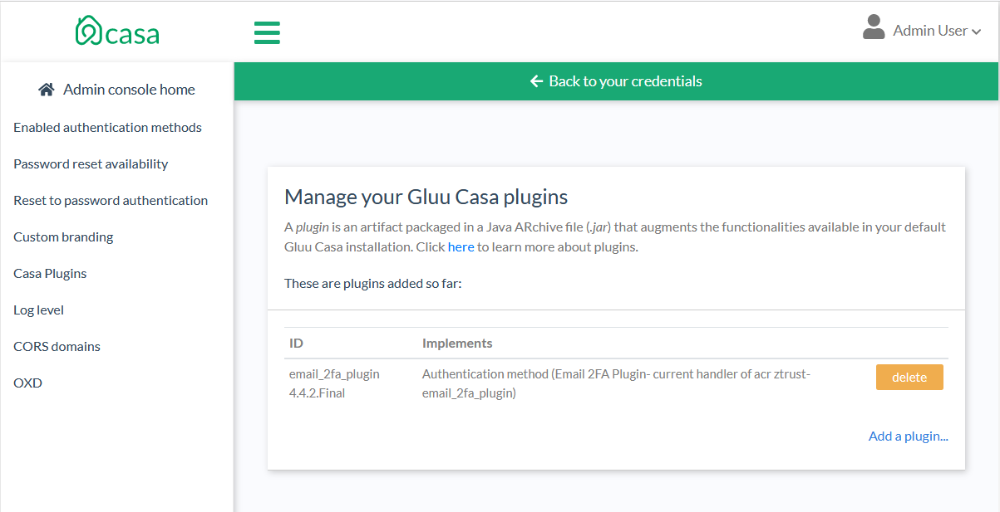
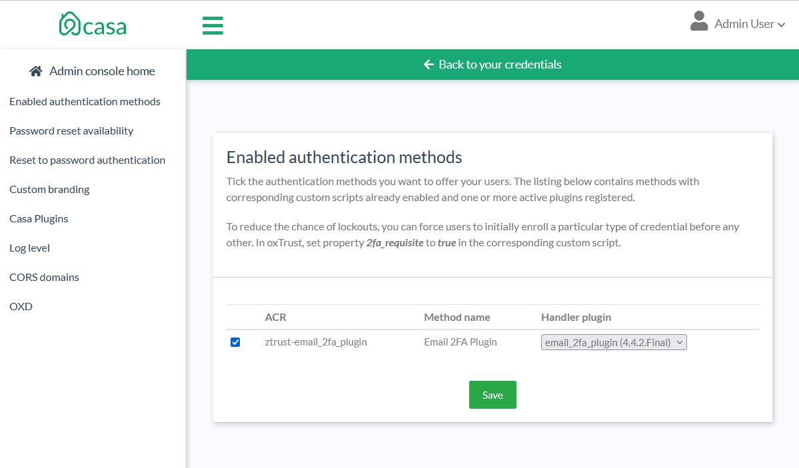
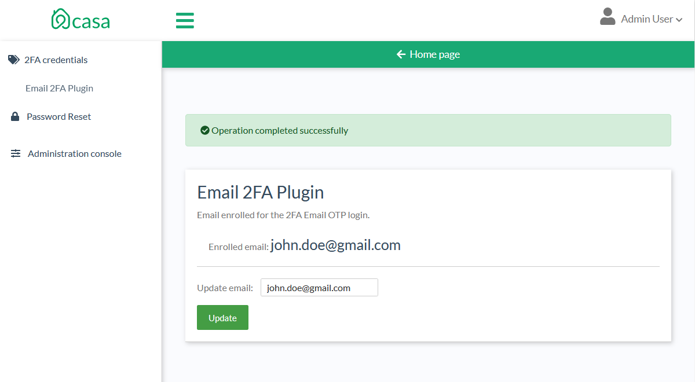
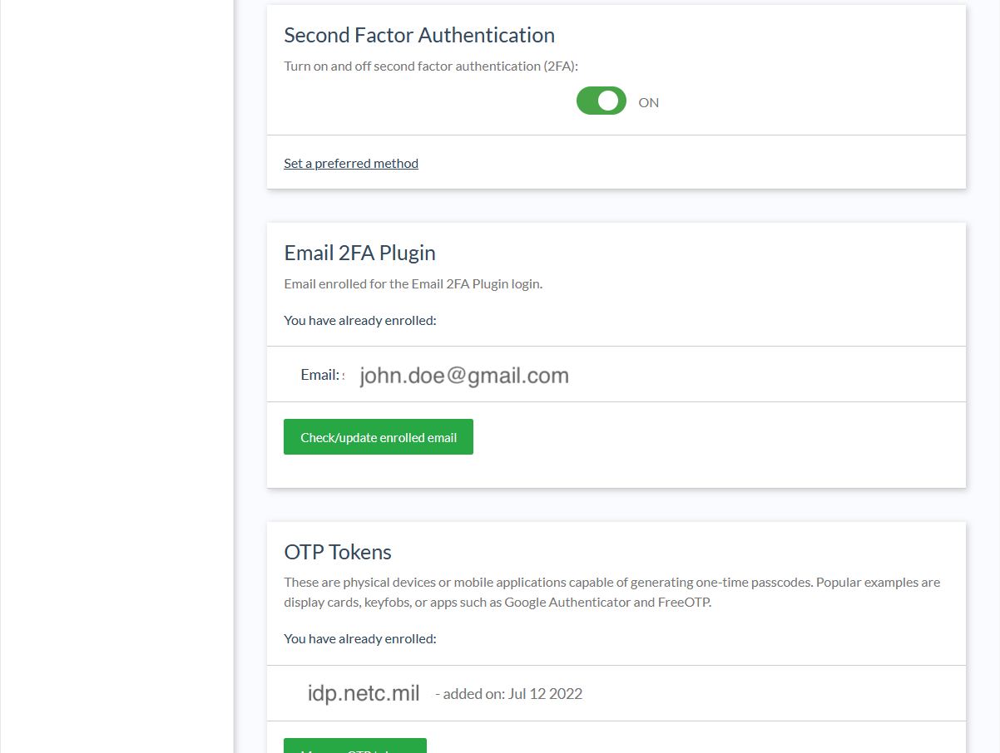
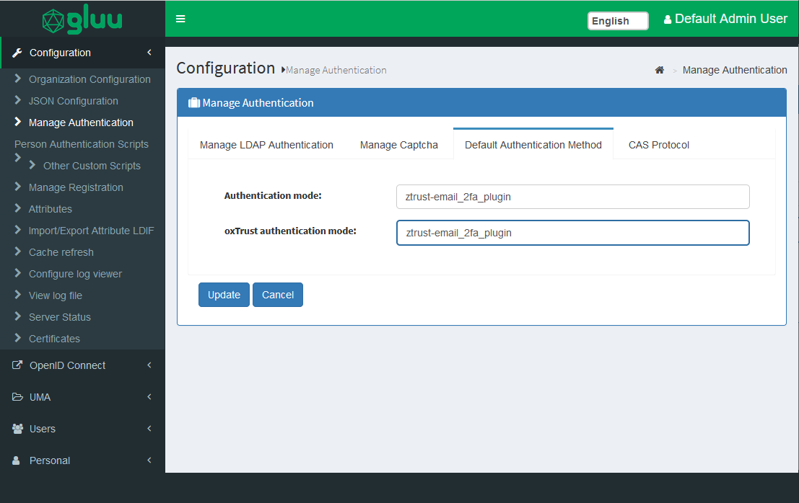

# EMail 2FA Authentication Plugin
## Plugin allows enrollment and authentication via user email address
Steps:

### 1. Intializing of SMTP server

This SMTP server and his account parameters will be used for sending emails with OTP.
Follow account parameters should be initialized on the page
**oxTrust** (**identity**): *Configuration*/*Organization Configuration*/*SMTP Server Configuration*:

- **SMTP Host**: domain name of smtp server:
    * for example: *smtp.gmail.com*, *smtp.mail.yahoo.com*;
- **From Name**: user name:
    * for example: *John Doe*;
- **From Email Address**: email address:
    * for example: *john.doe@gmail.com*;
- **Requires Authentication**
- **SMTP User Name**: acount id:
    * for example: *john.doe@gmail.com*, in some cases on some servers: *john.doe*;
- **SMTP Password**
- **SMTP Connect Protection**: secure protocol of the connection (*NONE*, *SSL/TLS*, *STARTTLS*):
    * for example: *smtp.gmail.com*: *SSL/TLS* - 465 port, *STARTTLS* - 587 port;
- **Trust Server**: If set, the **SMTP Host** will be marked as trusted server;
- **SMTP Port**: Number of TCP/IP port of the **SMTP Host**.

### 2. Intializing of Keystore

This Keystore and his keypair (*private key** and **public key/certificate**) will be used for singing emails.
Follow parameters should be initialized on the page:
**oxTrust** (**identity**): *Configuration*/*Organization Configuration*/*SMTP Server Configuration*:

- **KeyStore File Path**: keystore file path:
    * for example: */etc/certs/smtp-keys.bcfks*;
- **KeyStore Password**: keystore/alias password:
    * for example: *tRmJpb$1_&BzlEUC7*;
- **KeyStore Alias**: alias of an entry (keypair: **private key** and **public key/certificate**) in the keystore:
    * for example: *smtp_sig_ec256*;
- **Signing Algorithm**: algorithm is used for signing of an email:
    * for example: *SHA256withECDSA*;

After initializing **SMTP Server** and **Keystore**, applications (including the plug-in **email_2fa_plugin**) can sign emails and send them, using SMTP Server and his account.

### 2. Installing plug-in script (**email_2fa_plugin**)

- Login as **Admin User**;
- Install and enable (**Admin User**) script from file **email_2fa_plugin.py** as **Custom script** on this page:
**oxTrust** (**identity**): *Configuration*/*Person Authentication Scripts*/*Custom Scripts*;
- Parameters of the script defined in *README.md* (*<root-dir>/code/scripts/person_authn/email_2fa_plugin*);
- Script can be installed and used as Authentication Method without installed **Casa** and plug-in **email_2fa_plugin**;

### 3. Installing casa plug-in **email_2fa_plugin**)

- For installing casa plug-ins, it's necessary enable **Administrative mode**. It can be executed, creating file *.administrable* in the home directory of **Casa**
(*/opt/gluu/jetty/casa*). After re-launching **Casa**, **Administrative mode** will be enabled;
- Login as **Admin User**;
- Install (*Add a plugin*) of the plugin **emailotp** (**email_2fa_plugin**) on the page *Manage your Gluu Casa plugins* of **Casa**;

Installed plug-in:

### 4. Enabling casa plug-in **email_2fa_plugin**

- If plug-in script (**email_2fa_plugin**) has been added on this page: **oxTrust** (**identity**): *Configuration*/*Person Authentication Scripts*/*Custom Scripts*
this plug-in can be enabled on the page: *Enabled authentication methods* of **Casa**;

Enabled plug-in:

### 5. Tuning casa plug-in **email_2fa_plugin** (**Email 2FA Plugin**)

- If plug-in **email_2fa_plugin** has been enabled, user can get the plug-in **email_2fa_plugin** (**Email 2FA Plugin**) on the page:
*Manage your trusted credentials for account access* of **Casa**;
- Open the plug-in **email_2fa_plugin** (**Email 2FA Plugin**);
- Enter necessary email;

Manage your trusted credentials:

Email 2FA Plugin:

### 6. Enabling Tuning casa plug-in **email_2fa_plugin** (**Email 2FA Plugin**) as 2FA Plugin of **Casa**

- After setting up casa plug-in on the page: *Manage your trusted credentials for account access* of **Casa** the plug-in **email_2fa_plugin** (**Email 2FA Plugin**)
can be used as 2FA Plugin of **Casa**;
- Tune Second Factor Authentication if the required **Casa** requirements are implemented;

Tuning Second Factor Authentication:

### 7. Enabling Tuning casa plug-in **email_2fa_plugin** (**Email 2FA Plugin**) as an Authentication Method

- After setting up casa plug-in on the page: *Manage your trusted credentials for account access* of **Casa** the plug-in **email_2fa_plugin** (**Email 2FA Plugin**)
can be used as Authentication Method on this page: *Configuration*/*Manage Authentication*/*Default Authentication Method*.
- After setting up casa plug-in on the page: *Manage your trusted credentials for account access* of **Casa** the plug-in **email_2fa_plugin** (**Email 2FA Plugin**)
and enabling **email_2fa_plugin** (**Email 2FA Plugin**) as 2FA Plugin of **Casa**, it's possible to enable **delegated admin** plugin (**casa**) on this page:
*Configuration*/*Manage Authentication*/*Default Authentication Method*.

**email_2fa_plugin** defined as Default Second Factor Authentication:

**casa** defined as Default Second Factor Authentication:

### 8. 2FA Authentication, using **email_2fa_plugin** (**Email 2FA Plugin**) plugin of **Casa** or **delegated admin** plugin (**casa**) of **Casa**

Welcome Login Page:

2FA Login Page, that contains entered OTP:

