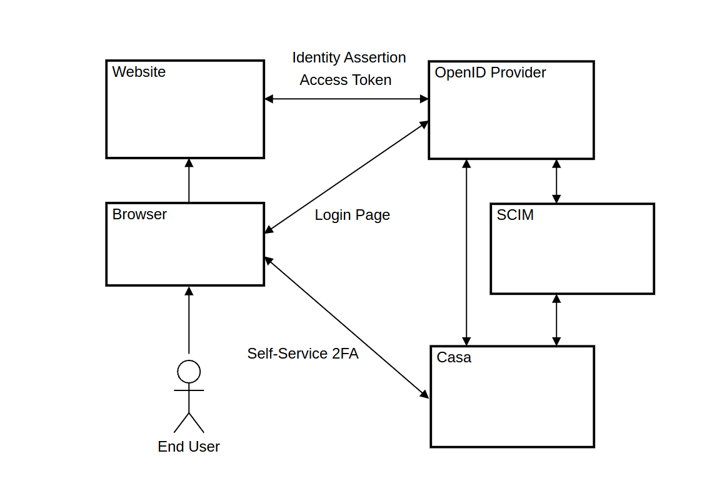

# Linux Foundation Janssen Project: Zero Trust Demo

Zero Trust Demo for Janssen 1.0.7 with OpenID

# Table of Contents

- [Linux Foundation Janssen Project: Zero Trust Demo](#linux-foundation-janssen-project--zero-trust-demo)
- [Table of Contents](#table-of-contents)
- [Solution Overview](#solution-overview)
  * [1. Use Cases](#1-use-cases)
    + [1.1. Registration](#11-registration)
    + [1.2. Authentication](#12-authentication)
    + [1.3. Credential Management](#13-credential-management)
    + [1.4. Restrict to single sessions](#14-restrict-to-single-sessions)
    + [1.5. Logout](#15-logout)
- [Installation](#installation)
  * [2. RHEL 8 installation](#2-rhel-8-installation)
    + [2.1. Base installation with DISA STIG Security Profile](#21-base-installation-with-disa-stig-security-profile)
    + [2.2. RHEL 8 Server Firewall](#22-rhel-8-server-firewall)
  * [3. Janssen Server Installation](#3-janssen-server-installation)
    + [3.1. Install Janssen GPG Key](#31-install-janssen-gpg-key)
    + [3.2. Install Janssen Server RPM](#32-install-janssen-server-rpm)
    + [3.3. Janssen Server setup](#33-janssen-server-setup)
    + [3.4. Janssen Server Verification](#34-janssen-server-verification)
  * [4. Gluu Casa Installation](#4-gluu-casa-installation)
  * [5. PostgreSQL Server Configuration](#5-postgresql-server-configuration)
  * [6. jans-auth configuration](#6-jans-auth-configuration)
    + [6.1. jans-auth properties](#61-jans-auth-properties)
    + [6.2. Custom assets](#62-custom-assets)
    + [6.3. jans-auth Email 2FA Script](#63-jans-auth-email-2fa-script)
      - [6.3.1. Generating private keys and certificates for signing emails](#631-generating-private-keys-and-certificates-for-signing-emails)
      - [6.3.2. Properties of Email 2FA Script](#632-properties-of-email-2fa-script)
    + [6.4. jans-auth User Registration Script](#64-jans-auth-user-registration-script)
    + [6.5. jans-auth CAC Card Script](#65-jans-auth-cac-card-script)
    + [6.6. jans-auth App Session Audit Script](#66-jans-auth-app-session-audit-script)
    + [6.7. jans-auth Extension ztrust-ext](#67-jans-auth-extension-ztrust-ext)
  * [7. Casa Configuration](#7-casa-configuration)
    + [7.1. Activation Casa plug-in](#71-activation-casa-plug-in)
    + [7.2. Password Policy Casa plug-in](#72-password-policy-casa-plug-in)
    + [7.3. Certificate Authentication plug-in](#73-certificate-authentication-plug-in)
  * [8. HTTPD configuration](#8-httpd-configuration)
    + [8.1. httpd SSL configuration](#81-httpd-ssl-configuration)
    + [8.2. httpd Enabling TLS v1.3 Protocol](#82-httpd-enabling-tls-v13-protocol)
    + [8.3. httpd Java application proxy configuration](#83-httpd-java-application-proxy-configuration)
    + [8.4. httpd Development load balancer](#84-httpd-development-load-balancer)

# Solution Overview

The purpose of the Zero Trust Framework (customizing) is to centralize authentication,
to enable Single Sign-on (SSO), and to provide a web portal to enable end-users to
view and manage their two-factor credentials. Diagram 1 provides an overview of
how federated SSO works. In this example, an End User starts his web browser,
navigates to the Website, and initiates a Login event. The Browser is
redirected to the Janssen Server, which returns the Login Page. After
authentication, the Website can obtain an Identity Assertion from the
Janssen Server which details the authentication event (e.g. who authenticated, when
they authenticated, how they authenticated), user claims (e.g. first name, last
name, role, email address, etc), and an access token (which the website can
present to other services to convey permissions). The End User can visit Casa to
enroll additional credentials or to register an email address or SMS phone
number.



##  1. Use Cases

###  1.1. Registration

1. **Register for new account with CAC/PIV card**  If a person has a smart card,
they can present it during the registration process, and we should pick up the
subject DN which has their name and `edipi`.
1. **Register for new account (no CAC/PIV card)**  If the person does not
yet have a CAC/PIV card, we should enroll email and an SMS number.
1. **Associate a CAC card against existing account**  This use case is possible
when a person registered before they obtained a CAC/PIV, and then want to
associate their smart card with their account.
1. **Registration for account with duplicate email** Do not allow.
1. **Required fields for registration**
1. **CAPTCHA**
1. **Password strength algorithm** Password policy should be customized.  
Example of some implemented password policy:  
"The minimum password length is 15 characters, containing at least one lowercase letter,
one uppercase letter, one number, and one special character".
1. **Disable automatic account enablement**  The Janssen Server admin can
restrict enrollment to certain domains.
1. **Redirect from Smart Card Login for unregistered person**.

###  1.2. Authentication

1. **FIDO**.
1. **email identifier** The end-user's email address is used for identification
(i.e. the email is the username).
1. **Smart Card**  The end user clicks on a button, which should prompt their
browser to enable the selection of an X.509 certificate.

###  1.3. Credential Management

1. **FIDO**.
1. **Smart Card** The end user should be able to enroll a CAC/PIV card, and to
view the details of an associated X.509 certificate.
1. **SMS**  The end user should be able to view, add, and remove an associated
phone number to receive SMS notifications.
1. **Change Password** End users should be able to change their password,
provided the new password meets the associated password complexity.

###  1.4. Restrict to single sessions

The Janssen Server should only allow an end-user to have one active session (web
or mobile). If an end-user logs in, previous sessions should be terminated in
the Janssen Server. Note: this does not imply that all applications will logout the
end-user at that time. However, if an OpenID Relying Party attempts to obtain a
token after the session has been revoked, the Janssen Server will re-authenticated
the person.

###  1.5. Logout

1. **Logout from Casa**  On hitting the logout button, the person's browser
should logout.
1. **Logout from OpenID Connect relying party (RP)**  Provided the RP has a
properly configured OpenID Connect client in the Janssen Server, and that it makes
the correct front-channel logout call, the Person's browser should be logged out
of the website.

# Installation

##  2. RHEL 8 installation

###  2.1. Base installation with DISA STIG Security Profile

If you are installing RHEL 8 from media:

* Under Software Selection, select `Minimal Install`

* Under Security Policy, select the `DISA STIG Security Policy`

* Enable networking and assign an **FQDN** hostname.

* Set the timezone

* Add a user with admin privileges (not `root`)

* You will need to create a custom disk layout. The following folders must be on
a separate partition or logical volume:

| mount point | Size |
| ----------- |------|
|`/tmp`| 1G|
|`/boot`| 500M|
|`/boot/efi`| 2G|
|`/home`| 3G|
|`/var`| 5G|
|`/var/log`| 3G|
|`/var/log/audit`| 2G|
|`/var/tmp`| 1G|
|`swap`| RAM Size|
|`/`| (the rest of the space)|

If you are using a cloud image, you can also apply the
[DISA-STIG](https://github.com/RedHatGov/rhel8-stig-latest)
settings by running the shell script provided by Red Hat,
`# bash rhel8-script-stig.sh`, and then rebooting.

###  2.2. RHEL 8 Server Firewall

The RHEL 8 system firewall should be running. You can check with this
command:

```bash
systemctl status firewalld
```

Open the `https` and `http` service for public access (http just
redirects to https, but opening it prevents some user confusion)

```bash
firewall-cmd --zone=public --permanent --add-service=https
firewall-cmd --zone=public --permanent --add-service=http
```

```bash
firewall-cmd --reload
```

To get the current state of the firewall:

```bash
firewall-cmd --list-all
```

##  3. Janssen Server Installation

This initial base configuration happens on Server 1-1. After the configuration
of 1-1 is complete, you will initialize the other servers.

###  3.1. Install Janssen GPG Key

* Download **Janssen** key:

```bash
wget https://repo.gluu.org/rhel/RPM-GPG-KEY-GLUU -O /etc/pki/rpm-gpg/RPM-GPG-KEY-GLUU
```

* Install **Janssen** key:

```bash
rpm --import /etc/pki/rpm-gpg/RPM-GPG-KEY-GLUU
```

* List of installed public keys:

```bash
rpm -qa gpg-pubkey*
```

* Get info about installed **Janssen** key:

```bash
rpm -qi gpg-pubkey-0544ba38-572aa647
```

###  3.2. Install Janssen Server RPM

You can always find the latest Gluu Server packages here (for all linux
distributions): [Janssen Releases](https://github.com/JanssenProject/jans/releases/).

Please, use follow doc for installing RHEL packages:
[Red Hat EL Janssen Installation](https://docs.jans.io/v1.0.7/admin/install/vm-install/rhel/).

###  3.3. Janssen Server setup

Please, use follow doc for running setup:
[Run the Setup Script](https://docs.jans.io/v1.0.7/admin/install/vm-install/rhel/#run-the-setup-script).

###  3.4. Janssen Server Verification

1. Check the version of the installed Jannsen components

```bash
python3 ./show_version.py

Title: jans-config-api-server-fips
Version: 1.0.7-SNAPSHOT
Builddate:
Build: a798e35dcf82de58a75d2299639b355300a79042

Title: SCIM API Server (FIPS)
Version: 1.0.7-SNAPSHOT
Builddate:
Build: a798e35dcf82de58a75d2299639b355300a79042

Title: Fido2 API Server (FIPS)
Version: 1.0.7-SNAPSHOT
Builddate:
Build: a798e35dcf82de58a75d2299639b355300a79042

Title: Jans authentication server (FIPS)
Version: 1.0.7-SNAPSHOT
Builddate:
Build: a798e35dcf82de58a75d2299639b355300a79042
```

1. Verify Janssen Server Access

* use these configuration endpoints for checking access:  
[Auth Server / Authorization](https://docs.jans.io/v1.0.7/admin/auth-server/endpoints/authorization/)  
[Auth Server / Crypto Keys](https://docs.jans.io/v1.0.7/admin/auth-server/crypto/keys/)  

* use these admin tools for checking access:  
[jans-cli Module Command line Admin Tool](https://docs.jans.io/v1.0.7/admin/config-guide/tui/)  
[jans_cli_tui Text User Interface Admin Tool](https://docs.jans.io/v1.0.7/admin/config-guide/tui/)  

<dl>
  <dt>Note:</dt>
  <dd>You need to allow https in the RHEL system firewall. You should
  have done this already (see above.)</dd>
</dl>

##  4. Gluu Casa Installation

For installing of Casa with Janssen Server, please use the **setup_casa.py** script.

```bash
usage: setup_casa.py [-h] [-jans-branch JANS_BRANCH] [-install-casa]
                     [-uninstall-casa] [-profile {jans,openbanking,disa-stig}]
                     [-casa-version CASA_VERSION]
                     [-casa-client-id CASA_CLIENT_ID]
                     [-casa-client-pw CASA_CLIENT_PW]

This script downloads Csas components and installs them

optional arguments:
  -h, --help            show this help message and exit
  -jans-branch JANS_BRANCH
                        Janssen github branch
  -install-casa         Install casa
  -uninstall-casa       Remove casa
  -profile {jans,openbanking,disa-stig}
                        Setup profile
  -casa-version CASA_VERSION
                        Casa version
  -casa-client-id CASA_CLIENT_ID
                        Casa client id
  -casa-client-pw CASA_CLIENT_PW
                        Casa client password
```

Example of installing command:

```bash
python3 ./setup_casa.py -profile='disa-stig' -jans-branch='main' -casa-version='5.0.0-12' -install-casa
```

or

```bash
python3 ./setup_casa.py -profile='disa-stig' -jans-branch='main' -casa-version='5.0.0-12' -casa-client-id='3000.21C12DDA-8542-423E-9501-DF49328A60B3' -casa-client-pw='12345678900$' -install-casa
```

.

If **-casa-client-id** and/or **-casa-client-pw** are defined, these values will be used as **Casa Client ID** and **Casa Client Secret**.
Example of output:

```text
...
Log Files:
/root/setup_casa/logs/casa-setup.log
/root/setup_casa/logs/casa-setup-error.log

Please wait while collecting properties...
Installing Casa
Adding casa config to jans-auth
Copying /opt/dist/jans/gluu-casa/pylib/casa-external_fido2.py to /opt/jans/python/libs
Copying /opt/dist/jans/gluu-casa/pylib/casa-external_super_gluu.py to /opt/jans/python/libs
Copying /opt/dist/jans/gluu-casa/pylib/casa-external_otp.py to /opt/jans/python/libs
Copying /opt/dist/jans/gluu-casa/pylib/casa-external_twilio_sms.py to /opt/jans/python/libs
Copying /opt/dist/jans/gluu-casa/pylib/Casa.py to /opt/jans/python/libs

Casa Client ID: 3000.21C12DDA-8542-423E-9501-DF49328A60B3
Casa Client Secret: 12345678900$

Importing LDIF Files
Calculating application memory
Deploying casa as Jetty application
Updating apache configuration
Restarting Apache
Restarting Jans Auth
Restarting Janssen Config Api
Starting Casa
Installation was completed

Casa https://gluu-1.smansoft.net/casa

Exit Setup Casa
```

.

If **-casa-client-id** and/or **-casa-client-pw** are not defined, random values **Casa Client ID** and **Casa Client Secret** will be generated.
Default **Casa Client ID** prefix is follow: **3000.**.

Example of uninstalling:

```bash
python3 ./setup_casa.py -profile='disa-stig' -jans-branch='main' -uninstall-casa
```

.

##  5. PostgreSQL Server Configuration

During launching **install.py** (**jans-linux-setup**), please  

1. don't use option **-ldap-admin-password**=**&lt;passw&gt;**;
1. use option **-local-rdbm**=**pgsql**;
1. use option **-rdbm-password**=**&lt;passw&gt;**;

Directory **&lt;root-dir&gt;/system/pgsql/schema** contains script: **ztrust_install_schema.py**.

This script can be used for installing ZTrust custom schema.  
Usage:

```bash
usage: ztrust_install_schema.py [-h] -rdbm-user RDBM_USER -rdbm-password
                                RDBM_PASSWORD [-rdbm-port RDBM_PORT] -rdbm-db
                                RDBM_DB -rdbm-host RDBM_HOST
                                [-in-json-fpath IN_JSON_FPATH]
                                [-in-ldif-fpath IN_LDIF_FPATH]
                                [-jans-setup-dpath JANS_SETUP_DPATH]
```

, where

```text
RDBM_USER           - database user name
RDBM_PASSWORD       - database user password
RDBM_DB             - database name to connect
RDBM_HOST           - database host
IN_JSON_FPATH       - input json file path (defitinions of tables) 
IN_LDIF_FPATH       - input ldif file path (entries, will be added to table, defined by objectClass in ldif) 
JANS_SETUP_DPATH    - path, shere jans setup has been installed
```

Example of usage:

```bash
python3 ztrust_install_schema.py -rdbm-user=jans -rdbm-password=1234567890$ -rdbm-db=jansdb -rdbm-host=192.168.64.65 -rdbm-port=5432 -in-json-fpath=/root/pgsql/ztrust_schema.json -in-ldif-fpath=/root/pgsql/ztrust-jans-attributes.ldif -jans-setup-dpath=/opt/jans/jans-setup
```

And correspondent output:

```text
Parameters:
rdbm_type = pgsql
rdbm_host = 192.168.64.65
rdbm_port = 5432
rdbm_db   = jansdb
rdbm_user = jans
rdbm_password = 1234567890$
in_json_fpath = /root/pgsql/ztrust_schema.json
in_ldif_fpath = /root/pgsql/ztrust-jans-attributes.ldif
jans-setup-dpath = /opt/jans/jans-setup
------------------------
database bind
reading schema file: /root/pgsql/ztrust_schema.json
creating tables from schema
Creating tables for ['/root/pgsql/ztrust_schema.json']
tables = ['CREATE TABLE "ztrustPerson" (doc_id VARCHAR(64) NOT NULL UNIQUE, "objectClass" VARCHAR(48), dn VARCHAR(128), "edipi" VARCHAR(64), "pivid" VARCHAR(64), "ossoUserDN" VARCHAR(64), "ossoSubscriberGuid" VARCHAR(64), "userStatus" VARCHAR(64), "lastlogin" VARCHAR(64), PRIMARY KEY (doc_id));']
Writing file /tmp/jans_tables.sql
import ldif file: /root/pgsql/ztrust-jans-attributes.ldif
------------------------
```

.

Follow tables will be added, after installing of the schema (after running of the script: **ztrust_install_schema.py**):  

```sql
SELECT table_catalog, table_schema, table_name, column_name, data_type, character_maximum_length, character_octet_length
FROM information_schema.columns
WHERE table_schema = 'public' AND table_name   = 'ztrustPerson';
```

```text
 table_catalog | table_schema |  table_name  |    column_name     |     data_type     | character_maximum_length | character_octet_length 
---------------+--------------+--------------+--------------------+-------------------+--------------------------+------------------------
 jansdb        | public       | ztrustPerson | doc_id             | character varying |                       64 |                    256
 jansdb        | public       | ztrustPerson | objectClass        | character varying |                       48 |                    192
 jansdb        | public       | ztrustPerson | dn                 | character varying |                      128 |                    512
 jansdb        | public       | ztrustPerson | edipi              | character varying |                       64 |                    256
 jansdb        | public       | ztrustPerson | pivid              | character varying |                       64 |                    256
 jansdb        | public       | ztrustPerson | ossoUserDN         | character varying |                       64 |                    256
 jansdb        | public       | ztrustPerson | ossoSubscriberGuid | character varying |                       64 |                    256
 jansdb        | public       | ztrustPerson | userStatus         | character varying |                       64 |                    256
 jansdb        | public       | ztrustPerson | lastlogin          | character varying |                       64 |                    256
```

.

Follow attributes will be added to the table **jansAttr** (after running of the script: **ztrust_install_schema.py**):

```sql
SELECT
    public."jansAttr".doc_id, public."jansAttr"."objectClass", public."jansAttr".dn,
    public."jansAttr".description, public."jansAttr"."jansAttrName", public."jansAttr"."jansAttrOrigin"
FROM public."jansAttr" where public."jansAttr"."jansAttrOrigin" = 'ztrustPerson';
```

```text
                doc_id                | objectClass |                               dn                               |                            description                            |    jansAttrName    | jansAttrOrigin 
--------------------------------------+-------------+----------------------------------------------------------------+-------------------------------------------------------------------+--------------------+----------------
 11978694-3e96-4f9c-ac3b-455cd063140f | jansAttr    | inum=11978694-3e96-4f9c-ac3b-455cd063140f,ou=attributes,o=jans | Electronic Data Interchange Personal Indentifier EDIPI aka DoD ID | edipi              | ztrustPerson
 e88df284-d234-43a7-89e7-cea41d6b2c3f | jansAttr    | inum=e88df284-d234-43a7-89e7-cea41d6b2c3f,ou=attributes,o=jans | Personal Identity Verification (PIV) Identifier                   | pivid              | ztrustPerson
 f851e4e9-1245-403b-9fa8-96e26d41c538 | jansAttr    | inum=f851e4e9-1245-403b-9fa8-96e26d41c538,ou=attributes,o=jans | Legacy OSSO User Distinguish Name                                 | ossoUserDN         | ztrustPerson
 c55cef08-969c-4e50-87e0-9b1e2a2061af | jansAttr    | inum=c55cef08-969c-4e50-87e0-9b1e2a2061af,ou=attributes,o=jans | Legacy OSSO Subscriber Global Unique Identifier                   | ossoSubscriberGuid | ztrustPerson
 3d9b76d4-9028-4411-ae81-8f3adc03b52f | jansAttr    | inum=3d9b76d4-9028-4411-ae81-8f3adc03b52f,ou=attributes,o=jans | The registration status of the user.                              | userStatus         | ztrustPerson
 d51b279b-f966-420d-b06f-f55663f5a1c6 | jansAttr    | inum=d51b279b-f966-420d-b06f-f55663f5a1c6,ou=attributes,o=jans | Last login time used to expire inactive users                     | lastlogin          | ztrustPerson
```

```sql
SELECT
    public."jansAttr".doc_id, public."jansAttr"."objectClass",
    public."jansAttr"."jansAttrName", public."jansAttr"."jansAttrOrigin",
    public."jansAttr"."jansSAML1URI", public."jansAttr"."jansSAML2URI"
FROM public."jansAttr" where public."jansAttr"."jansAttrOrigin" = 'ztrustPerson';
```

```text
                doc_id                | objectClass |    jansAttrName    | jansAttrOrigin |                 jansSAML1URI                  |            jansSAML2URI            
--------------------------------------+-------------+--------------------+----------------+-----------------------------------------------+------------------------------------
 11978694-3e96-4f9c-ac3b-455cd063140f | jansAttr    | edipi              | ztrustPerson   | urn:gluu:dir:attribute-def:edipi              | https://idp.example.com/saml/edipi
 e88df284-d234-43a7-89e7-cea41d6b2c3f | jansAttr    | pivid              | ztrustPerson   | urn:gluu:dir:attribute-def:pivid              | urn:oid:pivid
 f851e4e9-1245-403b-9fa8-96e26d41c538 | jansAttr    | ossoUserDN         | ztrustPerson   | urn:gluu:dir:attribute-def:ossoUserDN         | urn:oid:ossoUserDN
 c55cef08-969c-4e50-87e0-9b1e2a2061af | jansAttr    | ossoSubscriberGuid | ztrustPerson   | urn:gluu:dir:attribute-def:ossoSubscriberGuid | urn:oid:ossoSubscriberGuid
 3d9b76d4-9028-4411-ae81-8f3adc03b52f | jansAttr    | userStatus         | ztrustPerson   | urn:gluu:dir:attribute-def:userStatus         | urn:oid:userStatus
 d51b279b-f966-420d-b06f-f55663f5a1c6 | jansAttr    | lastlogin          | ztrustPerson   | urn:gluu:dir:attribute-def:lastlogin          | urn:oid:lastlogin
 ```

.

##  6. jans-auth configuration

###  6.1. jans-auth properties

Make these changes to the default jans-auth JSON configuration properties:

* `claimsParameterSupported` : `False`
* `disableU2fEndpoint` : `True`
* `bruteForceProtectionEnabled` : `True`

###  6.2. Custom assets

* For installing assets use script **ztrust_install_jans_auth_assets.py**:

```bash
python3 ./ztrust_install_jans_auth_assets.py --help

Usage: ztrust_install_jans_auth_assets.py [options]

Options:
  -h, --help            show this help message and exit
  -i IN_ARCH_FPATH, --in_arch_fpath=IN_ARCH_FPATH
                        input archive file path (default: 'zero-trust-demo-main.zip')
  -o OUT_BASE_DPATH, --out_base_dpath=OUT_BASE_DPATH
                        base output directory path (default: '/opt/jans')
```

During installing, set of resources (templates, images,...) will be extracted from archive and
and will be deployed to gluu diorectory (default: **/opt/jans**).

* Restart jans-auth

```bash
systemctl restart jans-auth  
```

###  6.3. jans-auth Email 2FA Script

This script asks the user to enter a password in step 1, sends a signed
email to the user with an OTP, and asks the user to enter the OTP in step 2.


```text
title Email OTP Authenticaiton

actor End User
participant Email Client
participant Browser
participant Website
participant Janssen
participant SMTP Server

jans-auth->Browser: Generating page for entering of user login
End User->Website: Initiating login
Website->Browser: Redirecting
Browser<->jans-auth: Page 1: identifier / password

jans-auth->jans-auth: Generating OTP
jans-auth->jans-auth: Rendering / Generating signed email
jans-auth->SMTP Server: Sending email
jans-auth->Browser: Diplay Page 2: Enter OTP
Email Client->End User: Receiving OTP
End User->Browser: Entering OTP
Browser->jans-auth: Sending OTP (POST form)
jans-auth->jans-auth: Validating OTP
jans-auth->Browser: Redirecting to website
Browser->Website: ... Continue with OpenID Code Flow
Website<->Browser: HTTP/HTTPS requests/responces
Browser<->End User: Website content
```

####  6.3.1. Generating private keys and certificates for signing emails

The Email 2FA Script needs a private key to sign the email. The example
`keytool` commands show how to generate a self-signed certificate and
certificate signing request (CSR) for several different key formats. In a
production deployment, you would only need to choose one signature algorithm.

***

| | |
|---|---|
|RSA Signature|**RSA**|
|Key length|**2048**|
|Signature alg|**SHA256withRSA**|

* self-signed

```bash
keytool -genkey -alias EmailSigner-RSA -keyalg RSA -keysize 2048 -sigalg SHA256withRSA \
  -dname "CN=SMTP CA Certificate" -validity 365 -storetype bcfks \
  -keystore /etc/certs/jans-email-signer.bcfks \
  -keypass ******** -storepass ******** \
  -providername BCFIPS -providerclass org.bouncycastle.jcajce.provider.BouncyCastleFipsProvider \
  -providerpath /opt/dist/app/bc-fips-1.0.2.3.jar:/opt/dist/app/bcpkix-fips-1.0.6.jar
```

* CSR

```bash
keytool -certreq -alias EmailSigner-RSA \
-keystore /etc/certs/jans-email-signer.bcfks \
-storetype bcfks -keyalg ec -file ./jans-email-signer.csr \
-keypass ******* -storepass ******* -providername BCFIPS \
-provider org.bouncycastle.jcajce.provider.BouncyCastleFipsProvider \
-providerpath /opt/dist/app/bc-fips-1.0.2.3.jar:/opt/dist/app/bcpkix-fips-1.0.6.jar
```

***

| | |
|---|---|
|ECDSA Signature, curve| **secp256r1** (**NIST P-256**)|
|Key length| **256**|
|Signature alg|**SHA256withECDSA**|

* Self-Signed

```bash
keytool -genkeypair -alias EmailSigner-EC -keyalg EC -groupname secp256r1
-sigalg SHA256withECDSA -dname "CN=SMTP CA Certificate" -validity 365
-storetype bcfks -keystore /etc/certs/jans-email-signer.bcfks \
-keypass ******** -storepass ******** -providername \
BCFIPS -providerclass org.bouncycastle.jcajce.provider.BouncyCastleFipsProvider \
-providerpath /opt/dist/app/bc-fips-1.0.2.3.jar:/opt/dist/app/bcpkix-fips-1.0.6.jar
```

* CSR

```bash
keytool -certreq -alias EmailSigner-EC \
-keystore /etc/certs/jans-email-signer.bcfks \
-storetype bcfks -keyalg ec -file ./jans-email-signer.csr \
-keypass ******* -storepass ******* -providername BCFIPS \
-provider org.bouncycastle.jcajce.provider.BouncyCastleFipsProvider \
-providerpath /opt/dist/app/bc-fips-1.0.2.3.jar:/opt/dist/app/bcpkix-fips-1.0.6.jar
```

***

| | |
|---|---|
|EDDSA Signature, curve|**Ed25519**|
|Key length|**256**|
|Signature alg|**Ed25519**|

* Self Signed

```bash
keytool -genkeypair -alias EmailSigner-Ed25519 -keyalg Ed25519 -sigalg Ed25519 \
  -dname "CN=SMTP CA Certificate" -validity 365 -storetype bcfks \
  -keystore /etc/certs/jans-email-signer.bcfks \
  -keypass ******* -storepass ******* \
  -providername BCFIPS -providerclass org.bouncycastle.jcajce.provider.BouncyCastleFipsProvider \
  -providerpath /opt/dist/app/bc-fips-1.0.2.3.jar:/opt/dist/app/bcpkix-fips-1.0.6.jar
```

* CSR

```bash
keytool -certreq -alias EmailSigner-Ed25519 \
-keystore /etc/certs/jans-email-signer.bcfks \
-storetype bcfks -keyalg ec -file ./jans-email-signer.csr \
-keypass ******* -storepass ******* -providername BCFIPS \
-provider org.bouncycastle.jcajce.provider.BouncyCastleFipsProvider \
-providerpath /opt/dist/app/bc-fips-1.0.2.3.jar:/opt/dist/app/bcpkix-fips-1.0.6.jar
```

***

| | |
|---|---|
|EDDSA Signature, curve|**Ed448**|
|Key length|**465**|
|SiGnature alg|**Ed448**|

* Self Signed

```bash
keytool -genkeypair -alias EmailSigner-Ed448 -keyalg Ed448 -sigalg Ed448 \
  -dname "CN=SMTP CA Certificate" -validity 365 -storetype bcfks \
  -keystore /etc/certs/jans-email-signer.bcfks \
  -keypass ******** -storepass ******** \
  -providername BCFIPS -providerclass org.bouncycastle.jcajce.provider.BouncyCastleFipsProvider \
  -providerpath /opt/dist/app/bc-fips-1.0.2.3.jar:/opt/dist/app/bcpkix-fips-1.0.6.jar
```

* CSR

```bash
keytool -certreq -alias EmailSigner-Ed448 \
-keystore /etc/certs/jans-email-signer.bcfks \
-storetype bcfks -keyalg ec -file ./jans-email-signer.csr \
-keypass ******* -storepass ******* -providername BCFIPS \
-provider org.bouncycastle.jcajce.provider.BouncyCastleFipsProvider \
-providerpath /opt/dist/app/bc-fips-1.0.2.3.jar:/opt/dist/app/bcpkix-fips-1.0.6.jar
```

***

* Change the ownership of the keystore so it can be read by jans-auth

```bash
chgrp gluu /etc/certs/jans-email-signer.bcfks
```

```bash
chmod g+r /etc/certs/jans-email-signer.bcfks
```

* You can check the certificate:

```bash
keytool -list -v -keystore /etc/certs/jans-email-signer.bcfks -storetype BCFKS \
  -keypass ******** \
  -storepass ******** \
  -providername BCFIPS \
  -provider org.bouncycastle.jcajce.provider.BouncyCastleFipsProvider \
  -providerpath /opt/dist/app/bc-fips-1.0.2.3.jar:/opt/dist/app/bcpkix-fips-1.0.6.jar
```

####  6.3.2. Properties of Email 2FA Script

Navigate to  *Configuration --> Person Authentication Scripts*, scroll to the
bottom of the page and click **Add custom script configuration**

* Specify the name as `ztrust-email_2fa_plugin` and add these properties:

|key                            | optional                    | value                                       |
|------------------------------ | --------------------------- | ------------------------------------------- |
|SCRIPT_FUNCTION                | yes (default: email_2fa)    | email_2fa                                   |
|token_length                   | no                          | 7                                           |
|token_lifetime                 | no                          | 15                                          |
|Signer_Cert_Alias              | yes (default: value from    | signer                                      |
|                               | SMTP properties )           |                                             |
|Signer_Cert_KeyStore           | yes (default: value from    | jans-email-signer.bcfks                       |
|                               | SMTP properties )           |                                             |  
|Signer_Cert_KeyStorePassword   | yes (default: value from    | *******                                     |
|                               | SMTP properties )           |                                             |  
|Signer_SignAlgorithm           | yes (default: value from    | SHA256withECDSA                             |
|                               | SMTP properties )           |                                             |  
|email_templates_json_file_path | no                          | /etc/jans/conf/ztrust-email-email_2fa.json    |
|regex_json_file_path           | no                          | /etc/jans/conf/ztrust-regex.json              |

* Copy and paste the text of `email_2fa_plugin.py` into the *Script* text area.

* Don't forget to check *Enabled* and click **Update**.

###  6.4. jans-auth User Registration Script


```text
title User Registration (register.py)

actor End User
participant Email Client
participant Browser
participant Website
participant jans-auth
participant OCSP Server
participant SMTP Server

End User->Browser: Initialize TLSv1.2 connect, handshake (SSLVerifyClient none)
Browser<->jans-auth: TLSv1.2 connect (SSLVerifyClient none)
jans-auth->Browser: Generating page for entering info of registered user
End User->Browser: Entering registering fields (FN, LN, MN, email address, passw)
End User->Browser: Loading user certificate ("Add CAC/PIV Card")
Browser<->jans-auth: Post handshake TLSv1.2
Browser<-jans-auth: SSLVerifyClient require, SSLOptions +ExportCertData
Browser->jans-auth: Registering fields (FN, LN, MN, email,  passw)
Browser->jans-auth: User certificate (X-ClientCert)
jans-auth->jans-auth: Generic certificate verification (expired or not)
jans-auth->jans-auth: Path certificate verification (CA certificate chain)
jans-auth->OCSP Server: OCSP certificate verification
OCSP Server->jans-auth: OCSP response
jans-auth->jans-auth: Generating OTP
jans-auth->jans-auth: Rendering (OTP) / Signing email
jans-auth->SMTP Server: Sending email to registering email address
jans-auth->Browser: Generating page for entering OTP
Email Client->End User: Receiving OTP
End User->Browser: Entering OTP
Browser->jans-auth: Sending OTP (POST form)
jans-auth->jans-auth: Validating OTP
jans-auth->Browser: Redirecting to the account of a registered user
Browser->End User: Access to the account of a registered user  
```

* Navigate to  *Configuration --> Person Authentication Scripts*, scroll
to the bottom of the page and click **Add custom script configuration**

* Specify the Name as `ztrust-register` and add these properties:

|key                          | value               |
|---------------------------- | ------------------- |
| attributes_json_file_path |  |
| regex_json_file_path |  |
| email_templates_json_file_path |  |
| crl_max_response_size |  specifies the maximum allowed size of [CRL] response. |
| use_crl_validator |  enable/disable specific certificate validation.  |
| use_generic_validator |  enable/disable specific certificate validation  |
| use_ocsp_validator |  enable/disable specific certificate validation.  |
| use_path_validator |  enable/disable specific certificate validation.  |
| chain_cert_file_path |  mandatory property pointing to certificate chains in [PEM] format.  |
| token_length |  Determines the length of the characters of the OTP sent to the user. |
| token_lifetime | Determines the time period for which the sent token is active. |
| Signer_Cert_Alias |  Alias of the keystore. |
| Signer_Cert_KeyStorePassword |  keystore password. |
| Signer_Cert_KeyStore | Filename of the keystore. |
| Signer_SignAlgorithm | Signature Algorithm. |
| Enable_User |  Enables User account registration if true. |
| Require_Email_Confirmation | If set, an OTP is sent before activating the registration. |

**use_generic_validator** - if this property is **true**, common check of client certificate (that checked certificate is not exprired) is provided;  
**use_path_validator** - if this property is **true**, certificate path (validity of CA(s) of certificate) is provided;  
**use_ocsp_validator** - if this property is **true**, OCSP check of client certificate (OCSP info (URI,...) is extracted is checked certificate) is provided;  
**use_crl_validator** - CLR lists are not used by ZTrust, so **false** value should be used;  

**attributes_json_file_path**:

Example of the attributes json file (defined by **attributes_json_file_path**):

```json
    {
        "ids": [
        "givenName",
        "sn",
        "familyName",
        "certificate",
        "captcha_elem"
        ],

        "passStrength": 2,
    }
```

, where:  
**"ids"** - arrays of IDs of elements, that should be used, by **reg.xhtml**, **regtr.xhtml** pages;  
        here is the array, that contains all possible IDs:  

```text
    var allIds = [
        "givenName",
        "familyName",
        "sn",
        "certificate",
        "captcha_elem"
    ];
```

;  
You can customize array "ids", using necessary IDs, that should be filled/defined during registering;  
    "passStrength" - **Password Strength**;  
    There are follow levels:  

```text
            var strength = {
                0: "Worst ",
                1: "Bad ",
                2: "Weak ",
                3: "Good ",
                4: "Strong ",
            };
```

**"passStrength"** defines lower level of a password strength, that can be approved on pages: **reg.xhtml**, **regtr.xhtml**.  

**regex_json_file_path**:

Example of the attributes json file (defined by **regex_json_file_path**):

```json
{
    "mail_regex": "^[a-zA-Z0-9\\.\\!\\#\\$\\%\\&\\'\\*\\+\\\\\/\\=\\?\\^\\_\\`\\{\\|\\}\\~\\-]+@(?:[a-zA-Z0-9]){1}(?:[a-zA-Z0-9-]{0,61}[a-zA-Z0-9])?(?:\\.[a-zA-Z0-9](?:[a-zA-Z0-9-]{0,61}[a-zA-Z0-9])?)*$",
    "pass_regex": "^(?=.*[a-z])(?=.*[A-Z])(?=.*\\d)(?=.*[\\~\\`\\!\\@\\#\\$\\%\\^\\&\\*\\(\\)\\-\\_\\+\\=\\{\\}\\[\\]\\|\\\\\/\\:\\;\\\"\\'\\<\\>\\,\\.\\?])[A-Za-z\\d\\~\\`\\!\\@\\#\\$\\%\\^\\&\\*\\(\\)\\-\\_\\+\\=\\{\\}\\[\\]\\|\\\\\/\\:\\;\\\"\\'\\<\\>\\,\\.\\?]{15,}$"
}
```

, where:  
**"mail_regex"** - regular expression, that defines requiremets to an email, entered on pages: **reg.xhtml**, **regtr.xhtml**;  
For example, if we have follow requirement:  

```text
        **Valid email domain validation**
```

then follow "mail_regex" value should be used:  

```text
        ^[a-zA-Z0-9\.\!\#\$\%\&\'\*\+\\\/\=\?\^\_\`\{\|\}\~\-]+@(?:[a-zA-Z0-9]){1}(?:[a-zA-Z0-9-]{0,61}[a-zA-Z0-9])?(?:\.[a-zA-Z0-9](?:[a-zA-Z0-9-]{0,61}[a-zA-Z0-9])?)*$
```

;  
this value should be updated to follow format in attributes json file:  

```text
        ^[a-zA-Z0-9\\.\\!\\#\\$\\%\\&\\'\\*\\+\\\\\/\\=\\?\\^\\_\\`\\{\\|\\}\\~\\-]+@(?:[a-zA-Z0-9]){1}(?:[a-zA-Z0-9-]{0,61}[a-zA-Z0-9])?(?:\\.[a-zA-Z0-9](?:[a-zA-Z0-9-]{0,61}[a-zA-Z0-9])?)*$
```

;  
**"pass_regex"** - regular expression, that defines additional requiremets to a password, entered on pages **reg.xhtml**, **regtr.xhtml**;  
For example, if we have follow requirement:  

```text
**Password strength algorithm**  The minimum password length is 15
characters, containing at least one lowercase letter, one uppercase letter, one
number, and one special character.
```

then follow "pass_regex" value should be used:  

```text
        ^(?=.*[a-z])(?=.*[A-Z])(?=.*\d)(?=.*[\~\`\!\@\#\$\%\^\&\*\(\)\-\_\+\=\{\}\[\]\|\\\/\:\;\"\'\<\>\,\.\?])[A-Za-z\d\~\`\!\@\#\$\%\^\&\*\(\)\-\_\+\=\{\}\[\]\|\\\/\:\;\"\'\<\>\,\.\?]{15,}$
```  

this value should be updated to follow format  in attributes json file:  

```text
        ^(?=.*[a-z])(?=.*[A-Z])(?=.*\\d)(?=.*[\\~\\`\\!\\@\\#\\$\\%\\^\\&\\*\\(\\)\\-\\_\\+\\=\\{\\}\\[\\]\\|\\\\\/\\:\\;\\\"\\'\\<\\>\\,\\.\\?])[A-Za-z\\d\\~\\`\\!\\@\\#\\$\\%\\^\\&\\*\\(\\)\\-\\_\\+\\=\\{\\}\\[\\]\\|\\\\\/\\:\\;\\\"\\'\\<\\>\\,\\.\\?]{15,}$
```

.

File **regex_json_file_path** can be updated manually or using plug-in **passw-policy_plugin**.

**email_templates_json_file_path**:

This file contains parameters, which are used, during generation of validation email (this email will contain **OTP**).

Example of the attributes json file (defined by **email_templates_json_file_path**):

```json
{
    "email_subject": "Registration Details",
    "email_msg_template": [
        "<h2 style='margin-left:10%%;color: #337ab7;'>Welcome</h2><hr style='width:80%%;border: 1px solid #337ab7;'></hr><div style='text-align:left;'>",
        "<p>First Name: <span style='color: #337ab7;'>%%fn%%</span>,</p>",
        "<p>Last Name: <span style='color: #337ab7;'>%%ln%%</span>,</p>",
        "<p>Middle Name: <span style='color: #337ab7;'>%%mn%%</span>,</p>",
        "<p>Email: <span style='color: #337ab7;'>%%email%%</span>,</p><p>Use <span style='color: #337ab7;'>%%otp%%</span> OTP to finish Registration.</p></div>"
    ]
}
```

, where:  
**"email_subject"** - text of email subject, that is sent, during registration;  
**"email_msg_template"** - template of text of email;

This template can use follow variables:

**%%fn%%** - First Name of registered user;  
**%%ln%%** - Last Name of registered user;  
**%%mn%%** - Middle Name of registered user;  
**%%email%%** - email address;  
**%%otp%%** - OTP (one-time password/code).

* Copy and paste the text of `register.py` into the *Script* text area.

* Don't forget to check *Enabled* and click **Update**.

###  6.5. jans-auth CAC Card Script

* launch **config-cli-tui.py** (**python3 -W ignore /opt/jans/jans-cli/config-cli-tui.py**);

* Navigate to  *Scripts*, and click **Add Script**;

* **Script Type**: Select **Person Authentication**;

* Specify the name as `ztrust-cert` and add these **Configuration properties** (**Conf. properties**):

|key                          | value               |
|---------------------------- | ------------------- |
| credentials_file |  mandatory property pointing to credentials file in [JSON] format.  |
| crl_max_response_size |  specifies the maximum allowed size of [CRL] response.  |
| map_user_cert |  specifies if the script should map new user to local account.  |
| use_crl_validator |  enable/disable specific certificate validation.  |
| use_generic_validator |  enable/disable specific certificate validation  |
| use_ocsp_validator |  enable/disable specific certificate validation.  |
| use_path_validator |  enable/disable specific certificate validation.  |
| chain_cert_file_path |  mandatory property pointing to certificate chains in [PEM] format.  |

Example of the attributes json file (defined by **credentials_file**) (**/etc/certs/cert_creds.json**):

```json
{
    "recaptcha":{
        "enabled":false,
        "site_key":"",
        "secret_key":""
    }
}
```

**use_generic_validator** - if this property is **true**, common check of client certificate (that checked certificate is not exprired) is provided;  
**use_path_validator** - if this property is **true**, certificate path (validity of CA(s) of certificate) is provided;  
**use_ocsp_validator** - if this property is **true**, OCSP check of client certificate (OCSP info (URI,...) is extracted is checked certificate) is provided;  
**use_crl_validator** - CLR lists are not used by ZTrust, so **false** value should be used;  
**chain_cert_file_path** - chain of CA (root, intermediate,...) certificate(s), for example, can be placed here: **/etc/certs/ztrust.chain**;

Example of some part of **openssl** configuration file, that allows to generate certificate with OCSP info during signing:

```text
[ ca ]
default_ca = gluuca

[ gluuca ]
...
x509_extensions = gluuca_extensions
...

[ gluuca_extensions ]
...
keyUsage = digitalSignature,nonRepudiation,keyEncipherment,dataEncipherment,keyAgreement,keyCertSign,cRLSign
extendedKeyUsage = clientAuth
authorityInfoAccess = @ocsp_section
...

[ ocsp_section ]
caIssuers;URI.0 = http://<ocsp.domain>/ztrust.chain
OCSP;URI.0 = http://<ocsp.domain>:8080
```

Example of text info of signed client certificate, that contains OCSP info (**Authority Information Access**):  

```text

        X509v3 extensions:
            X509v3 Basic Constraints: critical
                CA:FALSE
            X509v3 Subject Key Identifier:
                E9:C5:C6:61:04:45:DA:88:AB:47:C0:5A:73:F3:02:32:12:40:B4:59
            X509v3 Authority Key Identifier:
                keyid:DA:D6:19:AF:90:1A:6F:27:60:E8:4B:C6:BC:96:57:A9:52:2F:C2:60

            X509v3 Key Usage:
                Digital Signature, Non Repudiation, Key Encipherment, Data Encipherment, Key Agreement, Certificate Sign, CRL Sign
            X509v3 Extended Key Usage:
                TLS Web Client Authentication
            X509v3 Subject Alternative Name:
                DNS:Gluu ECDSA Client, DNS:Gluu Client ECDSA
            Authority Information Access:
                CA Issuers - URI:http://<ocsp.domain>/ztrust.chain
                OCSP - URI:http://<ocsp.domain>:8080
```

* Copy and paste the text of `cert-authn_plugin.py` into the *Script* text area.

* Don't forget to check *Enabled* and click **Update**.

###  6.6. jans-auth App Session Audit Script

* Navigate to  *Configuration --> Other Custom Scripts*,
using the horizontal slider, find the "Application Session"
script and click **Add custom script configuration**

* Specify the Name as `user_registration` and add these properties:

|key                          | value               |
|---------------------------- | ------------------- |
| metric_audit_ou_name | |

###  6.7. jans-auth Extension ztrust-ext

* Build extension **ztrust-ext**.

* Copy built jar (**ztrust-ext-4.4.2.Final.jar**) to the directory: **/opt/jans/jetty/jans-auth/custom/libs**.

* Open file: **/opt/jans/jetty/jans-auth/webapps/jans-auth.xml**.

* Add extension lib: **./custom/libs/ztrust-ext-4.4.2.Final.jar**:

```text
<Set name="extraClasspath">./custom/libs/twilio-7.17.0.jar,./custom/libs/jsmpp-2.3.7.jar,./custom/libs/ztrust-ext-4.4.2.Final.jar</Set></Configure>
```

* Restart jans-auth:

```bash
service jans-auth restart  
```

##  7. Casa Configuration

Before configuring the Casa script, confirm that you are able to login to the
Casa console by navigating to https://**server-1-1**/casa. You should see the
Casa login page.

1. Unlock the Casa Administration feature

```bash
touch /opt/gluu/jetty/casa/.administrable
```

```bash
chown casa:gluu /opt/gluu/jetty/casa/.administrable
```

If your Casa browser session is already open, logout / login and you should
see the Casa Admin Console menu option.

1. Install the plugin jar files. Plugin files can be installed, using 2 ways:

* Copy files to the directory */opt/gluu/casa/plugins*:

```bash
        cp approval_plugin-4.4.2.Final.jar \
        cert-authn_plugin-4.4.2.Final.jar \
        email_2fa_plugin-4.4.2.Final.jar \
        passw-policy_plugin-4.4.2.Final.jar \
        /opt/gluu/casa/plugins
```

```bash
        chown casa:gluu /opt/gluu/casa/plugins/*
```

* Upload **jar** files, using ("**Add a plugin...**"):


1. In the Casa Admin Console, navigate to the **Enabled authentication methods**
menu and select the ones you need.

Enabled scripts (in identity/oxtrust):


Enabled plug-ins:


###  7.1. Activation Casa plug-in


If user created (suring registering) as inactive, he will have state: **Pending**.

Using this plug-in, user(s) state can be setup in follow states:
  - Active
  - Inactive
.  

Also **pending** users can be activated.  

###  7.2. Password Policy Casa plug-in


**Password Policy Casa plug-in** allows to read/write the file **/etc/jans/conf/ztrust-regex.json**,
property: **pass_regex**.

For example, **pass_regex** can contain:

```json
{
    "pass_regex": "^(?=.*[a-z])(?=.*[A-Z])(?=.*\\d)(?=.*[\\~\\`\\!\\@\\#\\$\\%\\^\\&\\*\\(\\)\\-\\_\\+\\=\\{\\}\\[\\]\\|\\\\\/\\:\\;\\\"\\'\\<\\>\\,\\.\\?])[A-Za-z\\d\\~\\`\\!\\@\\#\\$\\%\\^\\&\\*\\(\\)\\-\\_\\+\\=\\{\\}\\[\\]\\|\\\\\/\\:\\;\\\"\\'\\<\\>\\,\\.\\?]{15,}$"
}
```

User can update this property, using plug-in. Also, user can generate a new Regular Expression, that can be coipied and saved in the
file **/etc/jans/conf/ztrust-regex.json**.

After that script **ztrust-register**, which have property **regex_json_file_path**, will use updated property **pass_regex** in the file **/etc/jans/conf/ztrust-regex.json**.

###  7.3. Certificate Authentication plug-in

**Certificate Authentication plug-in**  allows enrollment and authentication via client certificates.

Here is list of enrolled certificates by current user (**Admin**) account:  


Detailed info of enrolled certificates:  


Certificates with **multivalued DN** can be used. These certifciate (**Subject**) have been generated and singed, using option: **-multivalue-rdn**:  


Proceeding of new certificate:  


Selected certificate has been added:  


##  8. HTTPD configuration

Root configuration file: **/etc/httpd/conf/httpd.conf**
contains:

```text
IncludeOptional conf.d/*jans.conf
```

This definition **IncludeOptional conf.d/\*jans.conf** includes follow additional
**httpd** configuarion: **/etc/httpd/conf.d/https_jans.conf**.

Configuration files:  

* */etc/httpd/conf/httpd.conf*
* */etc/httpd/conf.d/https_jans.conf*

contain follow important directives:

```text
ServerRoot "/etc/httpd"
ServerName <server_domain_name>:80
Listen *:80
Listen *:443
ServerAdmin <server_admin_email>
```

Configuration files contain list of modules, which should be loaded:

```text
...
LoadModule unixd_module modules/mod_unixd.so
LoadModule socache_shmcb_module modules/mod_socache_shmcb.so
LoadModule socache_dbm_module modules/mod_socache_dbm.so
...
LoadModule proxy_module modules/mod_proxy.so
LoadModule proxy_http_module modules/mod_proxy_http.so
LoadModule ssl_module modules/mod_ssl.so
...
```

For example modules:

```text
LoadModule socache_shmcb_module modules/mod_socache_shmcb.so
LoadModule socache_dbm_module modules/mod_socache_dbm.so
```

should be used when caches **shmcb** or **dbm** are used.
You can select necessary cache type, changing configuration in correspondent configurartion sections.

**shmcb** - has hiher performace, cache data are saved in shared memory segment;  
**dbm** - cache data are saved in files on disk.  

Very important module:

```text
LoadModule ssl_module modules/mod_ssl.so
```

that provides usage of HTTPS (443) protocol.

Module:

```text
LoadModule proxy_http_module modules/mod_proxy_http.so
```

provides proxying HTTP and HTTPS requests.

Module:

```text
LoadModule proxy_module modules/mod_proxy.so
```

Provides proxy/gateway for Apache HTTP Server (**ProxyPass** directive).

Configuration contains definitions of directve:

**\<VirtualHost address[:port] [address[:port]] ...\> ... \<VirtualHost\>** for ports **80** and **443**:  

* **\<VirtualHost \*:80\>** - redirect of **http** (port **80**) requests to **https** (port **443**);  
* **\<VirtualHost \*:443\>** - definintion of processing of **https** requests.  

###  8.1. httpd SSL configuration

Apache server should use module **ssl**.

```text
LoadModule ssl_module modules/mod_ssl.so
```

Important security issues of definition of **\<VirtualHost *:443\>** directive:  

```text
    SSLEngine on
    SSLProtocol -all +TLSv1.2
    SSLCipherSuite ECDHE-RSA-AES256-GCM-SHA384:ECDHE-RSA-AES128-GCM-SHA256:DHE-RSA-AES256-GCM-SHA384:DHE-RSA-AES128-GCM-SHA256
    SSLHonorCipherOrder On
    SSLCertificateFile /etc/certs/httpd.crt
    SSLCertificateKeyFile /etc/certs/httpd.key
    SSLCACertificateFile /etc/certs/user-jans.org.chain
```

where:
**SSLProtocol -all +TLSv1.2** - will be used follow version of Transport Layer Security (TLS) **TLSv1.2**  
**SSLCipherSuite ECDHE-RSA-AES256-GCM-SHA384:ECDHE-RSA-AES128-GCM-SHA256:DHE-RSA-AES256-GCM-SHA384:DHE-RSA-AES128-GCM-SHA256** - suite of ciphers, used by SSL Protocol (**+TLSv1.2**).  

**SSLCertificateKeyFile /etc/certs/httpd.key** - server SSL key (PEM-encoded)  
**SSLCertificateFile /etc/certs/httpd.crt**    - server SSL certificate (PEM-encoded)  

**/etc/certs/httpd.key** - server PEM-encoded private key file;  
**/etc/certs/httpd.crt** - server PEM-encoded X.509 certificate (public key) data file, may include Intermediate Certificates of Certificate Chain;  
**/etc/certs/httpd.csr** - server PEM-encoded X.509 certificate request.  

These file have be generated, using follow suite of commands:  

```bash
/usr/bin/openssl genrsa -out /etc/certs/httpd.key.noenc
/usr/bin/openssl pkey -in /etc/certs/httpd.key.noenc -out /etc/certs/httpd.key.orig -des3 -passout pass:<some_pass_value>
/usr/bin/openssl rsa -in /etc/certs/httpd.key.orig -passin pass:<some_pass_value> -out /etc/certs/httpd.key
/usr/bin/openssl req -new -key /etc/certs/httpd.key -out /etc/certs/httpd.csr -subj /C=Country/ST=State/L=City/O=Organization/CN=Web_Server_Domain/emailAddress=Admin_Email
/usr/bin/openssl x509 -req -days 365 -in /etc/certs/httpd.csr -signkey /etc/certs/httpd.key -out /etc/certs/httpd.crt
```

or this more simple case (without encrypted provate key) can be used:

```bash
/usr/bin/openssl genrsa -out /etc/certs/httpd.key
/usr/bin/openssl req -new -key /etc/certs/httpd.key -out /etc/certs/httpd.csr -subj /C=Country/ST=State/L=City/O=Organization/CN=Web_Server_Domain/emailAddress=Admin_Email
/usr/bin/openssl x509 -req -days 365 -in /etc/certs/httpd.csr -signkey /etc/certs/httpd.key -out /etc/certs/httpd.crt
```

Follow commands can be used for getting detailed info:

```bash
openssl x509 -inform PEM -in /etc/certs/httpd.crt -text
openssl req -inform PEM -in /etc/certs/httpd.csr -text
openssl pkey -inform PEM -in /etc/certs/httpd.key -text
openssl pkey -inform PEM -in /etc/certs/httpd.key.orig -passin file:./.pw -text
openssl pkey -inform PEM -in /etc/certs/httpd.key.orig -passin pass:<some_pass_value> -text
```

, where *./.pw* - temporary file, that contains password of the */etc/certs/httpd.key.orig* file.

You should use own private key and certificate, signed by **X-509 CA**, updating directives:  
**SSLCertificateKeyFile**  
**SSLCertificateFile**  

Usage of SSL Session Cache:

```text
SSLSessionCache "dbm:run/ssl_scache"
#SSLSessionCache "shmcb:run/ssl_scache(512000)"
#SSLSessionCache none
SSLSessionCacheTimeout  300
```

, where:
**SSLSessionCache** defines tpe of the SSL Session Cache:
**SSLSessionCache "dbm:run/ssl_scache"** - using DBM hashfile on the disk;  
**SSLSessionCache "shmcb:run/ssl_scache(512000)"** - high-performance cyclic buffer inside a shared memory segment in RAM;  
**(512000)** - size of cache memory segment;
**SSLSessionCache none** - SSL cache will not be used.  

Usage of SSL OCSP Stapling:

```text
SSLUseStapling on
SSLStaplingResponderTimeout 300
SSLStaplingCache "dbm:run/ssl_stapling"
#SSLStaplingCache "shmcb:run/ssl_stapling(512000)"
```

, where:
**SSLStaplingCache "dbm:run/ssl_stapling"** - using DBM file for saving stapling cache;
**SSLStaplingCache "shmcb:run/ssl_stapling(512000)"** - using high-performance cyclic buffer inside a shared memory segment in RAM.  

Example of OCSP checking:

```bash
openssl s_client -connect <server_domain_name>:443 -tls1_2 -tlsextdebug -status
openssl s_client -connect <server_domain_name>:443 -tls1_3 -tlsextdebug -status
```

During providing SSL handshake, server sends responce, that should contains follow info:

```text
OCSP response:
======================================
OCSP Response Data:
    OCSP Response Status: successful (0x0)
    Response Type: Basic OCSP Response
    Version: 1 (0x0)
    Responder Id: C = US, O = Let's Encrypt, CN = R3
    Produced At: Aug 15 01:17:00 2022 GMT
    Responses:
    Certificate ID:
      Hash Algorithm: sha1
      Issuer Name Hash: 48DAC9A0FB2BD32D4FF0DE68D2F567B735F9B3C4
      Issuer Key Hash: 142EB317B75856CBAE500940E61FAF9D8B14C2C6
      Serial Number: 04FCD01E9256F15589EC425370257F4ADBAE
    Cert Status: good
    This Update: Aug 15 01:00:00 2022 GMT
    Next Update: Aug 22 00:59:58 2022 GMT

    Signature Algorithm: sha256WithRSAEncryption
         01:61:1c:17:d2:18:9e:63:9c:00:cc:1c:f0:52:a5:e0:39:b3:
         fc:9b:b3:ab:29:88:6e:c3:e2:c8:4a:73:93:40:72:0b:0d:eb:
         39:a0:73:90:6c:0e:be:ce:e2:51:40:11:37:1c:e7:22:8c:12:
         4b:2b:df:fd:6e:03:19:d4:c0:f5:8a:db:fb:58:fb:37:c4:af:
         f1:a4:c9:1f:c6:ba:21:48:f7:ac:64:9f:ee:df:6e:74:61:fd:
         e1:51:d1:d8:2b:1a:90:c3:1b:d6:92:31:5d:32:d2:0d:01:9c:
         42:64:0e:b6:7b:7a:62:1d:0a:93:a7:2b:c1:81:3a:3f:64:f4:
         d2:e2:99:63:6b:8e:25:19:18:3d:44:0d:59:2a:47:be:93:86:
         2d:cb:12:7c:60:de:0c:a4:2f:76:38:ca:7e:4b:c5:2c:12:4c:
         70:66:2d:b9:8a:45:11:d6:2e:3a:fa:a7:f6:99:23:7d:89:f1:
         9d:01:9c:df:28:2c:38:ad:77:33:14:af:cf:45:63:31:de:c6:
         30:87:4c:aa:f9:bc:01:4a:c0:0d:03:48:7f:48:2f:04:dc:b6:
         34:38:d1:28:59:74:99:88:fb:7c:38:88:3a:8c:a6:57:57:83:
         90:c9:d0:b5:72:0f:29:8d:34:7d:e6:a8:7b:59:fd:28:ef:26:
         91:c5:ba:51
======================================
```

```text
    SSLCACertificateFile /etc/certs/user-jans.org.chain
    SSLCACertificatePath /etc/ssl/certs
```

**SSLCACertificateFile /etc/certs/user-jans.org.chain**   - file, where trust CA certificates (Root and Intermediate) (PEM-encoded) are placed;  
or  
**SSLCACertificatePath /etc/ssl/certs** - directory, where trust CA certificates (Root and Intermediate) (PEM-encoded) are placed;  

**SSLCACertificateFile** and **SSLCACertificatePath** should be used, when Client Certificate Authentication is used.  

httpd configation file can contain only one directive **SSLCACertificateFile** or **SSLCACertificatePath**.  

```text
    SSLOCSPEnable on
    SSLOCSPDefaultResponder "http://<ocsp.domain:8080>"
    SSLOCSPOverrideResponder on
    SSLOCSPResponderCertificateFile /etc/certs/ocsp.crt
```

**SSLOCSPEnable** - enabling processing, using OCSP protocol of client certificates;  
**SSLOCSPResponderCertificateFile** - OCSP certficate (file path);  
**SSLOCSPDefaultResponder** - default OCSP server (URI);  
**SSLOCSPOverrideResponder** - if **on**, then **SSLOCSPDefaultResponder** will be used even OCSP url(s) defined in client certificates,
othervise (if **off**) **SSLOCSPDefaultResponder** will be used only if client certificate doens't contain OCSP url(s).

As **OCSP** server you can use **openssl**.  

```bash
openssl ocsp -index ./certindex -port 8080 -rsigner ./ocsp.crt -rkey ./ocsp.key -CA ./ocsp.chain -CAfile ./ocsp.chain -text -out log.txt
```

here is **./certindex** - database of certificates. Example of database:

```text
R 271007051208Z   1000  unknown /CN=Gluu.Intermediate.ECDSA/ST=TX/C=US/emailAddress=support@jans.io/O=Gluu, Inc/OU=Gluu Intermediate ECDSA
V 271010190051Z   1001  unknown /CN=Gluu.Intermediate.ECDSA/ST=TX/C=US/emailAddress=support@jans.io/O=Gluu, Inc/OU=Gluu Intermediate ECDSA
R 271007050921Z   1002  unknown /CN=Gluu.Cln.ECDSA/ST=Texas/C=US/emailAddress=client@jans.io/O=Gluu, Inc/OU=Gluu Client ECDSA
V 271010190203Z   1003  unknown /CN=Gluu.Cln.ECDSA/ST=Texas/C=US/emailAddress=client@jans.io/O=Gluu, Inc/OU=Gluu Client ECDSA
V 271010190333Z   1004  unknown /CN=Gluu.OCSP.ECDSA/ST=Texas/C=US/emailAddress=ocsp@jans.io/O=Gluu, Inc/OU=Gluu OCSP ECDSA
```

**./ocsp.key** - key, that is used by OCSP server;  
**./ocsp.crt** - OCSP certificate;  
**./ocsp.chain** - CA (Root and Intermediate) of OCSP certificate.  

###  8.2. httpd Enabling TLS v1.3 Protocol

Optional feature. For enabling **TLS v1.3** protocol you should update httpd configuration files:

* */etc/httpd/conf/httpd.conf*
* */etc/httpd/conf.d/https_jans.conf*

Update

```text
  SSLProtocol -all +TLSv1.2
```

to

```text
  SSLProtocol -all +TLSv1.2 +TLSv1.3
```

After relaunching httpd **TLS v1.3** will be used by **HTTPS**. But when you use **cert** authentication of Gluu, i.e. **Client Autehntication**,
should be provided follow additional tunings on the httpd server side and on the client/browser side (if **TLS v1.3** has been enabled).

There is some way, using **Mozilla Firefox**, when you can use **TLSv1.3** and **Client Autehntication**, activating **HTTP/2.0** and
posthandshake in **Mozilla Firefox**:

Disable loading of **mpm** moidules.

Add loading of modules:

```text
LoadModule mpm_event_module modules/mod_mpm_event.so
LoadModule http2_module modules/mod_http2.so
```

Add to the definition of ```<VirtualHost *:443>```:

```text
Protocols h2 h2c
```

Here are:

* **h2** - **HTTP/2.0** over **TLS**
* **h2c** - **HTTP/2.0** over **TCP**

Open **about:config** in **Mozilla Firefox** and setup **security.tls.enable_post_handshake_auth** to **true**.

Clear cache data and history of **Mozilla Firefox** and relaunch **Mozilla Firefox**.
After that you can get working **Client Authentication** with **TLS v1.3**, and you can use **cert** Authenticate method (**Mozilla Firefox** is a client only).
You can see follow **httpd** logs (**TLS v1.3** and **HTTP/2.0**):  

```text
... "GET /identity HTTP/2.0" 302 - "-" "Mozilla/5.0 (Windows NT 10.0; Win64; x64) AppleWebKit/537.36 (KHTML, like Gecko) Chrome/105.0.0.0 Safari/537.36 OPR/91.0.4516.77"
... "GET /identity/ HTTP/2.0" 200 81 "-" "Mozilla/5.0 (Windows NT 10.0; Win64; x64) AppleWebKit/537.36 (KHTML, like Gecko) Chrome/105.0.0.0 Safari/537.36 OPR/91.0.4516.77"
... "GET /identity/home.htm HTTP/2.0" 302 - "https://<domain>/identity/" "Mozilla/5.0 (Windows NT 10.0; Win64; x64) AppleWebKit/537.36 (KHTML, like Gecko) Chrome/105.0.0.0 Safari/537.36 OPR/91.0.4516.77"
... "GET /identity/login.htm HTTP/2.0" 302 - "https://<domain>/identity/" "Mozilla/5.0 (Windows NT 10.0; Win64; x64) AppleWebKit/537.36 (KHTML, like Gecko) Chrome/105.0.0.0 Safari/537.36 OPR/91.0.4516.77"
```

```text
[...] [ssl:trace3] [pid ...] ssl_engine_kernel.c(2222): [client ...] OpenSSL: Loop: SSLv3/TLS read client hello
[...] [ssl:trace3] [pid ...] ssl_engine_kernel.c(2222): [client ...] OpenSSL: Loop: SSLv3/TLS write server hello

[...] [ssl:trace3] [pid ...] ssl_engine_kernel.c(2222): [client ...] OpenSSL: Loop: SSLv3/TLS write finished
[...] [ssl:trace3] [pid ...] ssl_engine_kernel.c(2222): [client ...] OpenSSL: Loop: TLSv1.3 early data
```

At the current moment we can recommend to use **Client Authentication** (**cert** Authenticate method) with **TLS v1.3** and **HTTP/2.0**, using only **Mozilla Firefox** browser.

###  8.3. httpd Java application proxy configuration

After installing **Jansssen Suite** on the server (full configuring), follow servers are launched:

| serivce/application | ports |
| ----------- |------|
|`httpd`|0.0.0.0:80|
|`httpd`|0.0.0.0:443|
|`jans-auth`|127.0.0.1:8081|
|`jans-fido2`|127.0.0.1:8073|
|`jans-scim`|127.0.0.1:8087|
|`casa`|127.0.0.1:8099|
|`postgresql`|127.0.0.1:5432|

Some servers (**jans-auth**, **jans-fido2**, **jans-scim**, **casa**) launched on the **localhost** (**127.0.0.1**) interface.
Outer access to these servers organized via **httpd**, using suite of **Reverse Proxies**.

Here are some proxy tuning, you need follow modules:  
**mod_proxy** (**LoadModule proxy_module modules/mod_proxy.so**)  
**mod_proxy_http** (**LoadModule proxy_http_module modules/mod_proxy_http.so**).  

Disabling usage of **ProxyPass** as **Forward Proxies**.

```text
    ProxyRequests Off
```

Suite of **Reverse Proxies** for getting access to the localhosted resources:  

```text
    <Location /jans-scim>
        ProxyPass http://localhost:8087/jans-scim retry=5 connectiontimeout=60 timeout=60
        Order deny,allow
        Allow from all
    </Location>

    <Location /jans-fido2>
        ProxyPass http://localhost:8073/jans-fido2 retry=5 connectiontimeout=60 timeout=60
        Order deny,allow
        Allow from all
    </Location>

    <Location /jans-auth>
        ProxyPass http://localhost:8081/jans-auth retry=5 connectiontimeout=60 timeout=60
        # Header set Access-Control-Allow-Origin "*"
        Order deny,allow
        Allow from all
    </Location>

    <Location /jans-config-api>
        ProxyPass http://localhost:8074/jans-config-api retry=5 connectiontimeout=60 timeout=60
        Order deny,allow
        Allow from all
    </Location>

    <Location /jans-eleven>
        ProxyPass http://localhost:8075/jans-eleven retry=5 connectiontimeout=60 timeout=60
        Order deny,allow
        Allow from all
    </Location>

    <Location /jans-auth/auth/cert/cert-login.htm>
        SSLVerifyClient optional_no_ca
        SSLVerifyDepth 10
        SSLOptions -StdEnvVars +StrictRequire +ExportCertData

        # Check for client cert revocation via OCSP
        # SSLOCSPEnable on
        # SSLOCSPDefaultResponder "{OCSP Responder URL}"
        # SSLOCSPOverrideResponder on
        # SSLOCSPResponderCertificateFile "{OCSP certificate path}"

        # Forward certificate to destination server
        RequestHeader set X-ClientCert %{SSL_CLIENT_CERT}s
    </Location>

    ProxyPass   /.well-known/openid-configuration http://localhost:8081/jans-auth/.well-known/openid-configuration
    ProxyPass   /.well-known/webfinger http://localhost:8081/jans-auth/.well-known/webfinger
    ProxyPass   /.well-known/uma2-configuration http://localhost:8081/jans-auth/restv1/uma2-configuration
    ProxyPass   /.well-known/fido-configuration http://localhost:8081/jans-auth/restv1/fido-configuration
    ProxyPass   /.well-known/fido-u2f-configuration http://localhost:8081/jans-auth/restv1/fido-configuration
    ProxyPass   /.well-known/fido2-configuration http://localhost:8073/jans-fido2/restv1/configuration
    ProxyPass   /.well-known/scim-configuration http://localhost:8087/jans-scim/restv1/scim-configuration
    ProxyPass   /firebase-messaging-sw.js http://localhost:8081/jans-auth/firebase-messaging-sw.js
    ProxyPass   /device-code http://localhost:8081/jans-auth/device_authorization.htm
```

###  8.4. httpd Development load balancer

This configuration was used to test the customer in the development environment.

When you use **Load Balancer**, you need separate server node and suite of balance members.
Here is example of configuring of **Load Balancer** Server.

```text
LoadModule headers_module modules/mod_headers.so

LoadModule proxy_module modules/mod_proxy.so
LoadModule proxy_http_module modules/mod_proxy_http.so
LoadModule ssl_module modules/mod_ssl.so

LoadModule proxy_balancer_module modules/mod_proxy_balancer.so

LoadModule lbmethod_bybusyness_module modules/mod_lbmethod_bybusyness.so
LoadModule lbmethod_byrequests_module modules/mod_lbmethod_byrequests.so
LoadModule lbmethod_bytraffic_module modules/mod_lbmethod_bytraffic.so
```

```text
<VirtualHost *:80>

  Redirect / https://<server_domain_name>/

  ...

</VirtualHost>
```

```text
<IfModule mod_ssl.c>
  <VirtualHost _default_:443>

    ServerName <server_domain_name>:443

    DocumentRoot /var/www/html

    SSLCertificateFile /etc/letsencrypt/live/<server_domain_name>/fullchain.pem
    SSLCertificateKeyFile /etc/letsencrypt/live/<server_domain_name>/privkey.pem

    SSLEngine on
    SSLProtocol -all +TLSv1.2
    SSLCipherSuite ECDHE-RSA-AES256-GCM-SHA384:ECDHE-RSA-AES128-GCM-SHA256:DHE-RSA-AES256-GCM-SHA384:DHE-RSA-AES128-GCM-SHA256
    SSLHonorCipherOrder On

    # SetEnv proxy-nokeepalive 1
    SetEnv proxy-initial-not-pooled 1
    Timeout 60
    ProxyTimeout 60

    # Turn off support for true Proxy behaviour as we are acting as a transparent proxy.
    ProxyRequests Off

    # Turn off VIA header as we know where the requests are proxied.
    ProxyVia Off

    # Turn on Host header preservation so that the servlet container
    # can write links with the correct host and rewriting can be avoided.
    ProxyPreserveHost On

    # Turn on usage of the SSL/TLS Protocol Engine for proxy.
    SSLProxyEngine on

    # Definition of the Load Balancer.  
    <Proxy "balancer://ztrust_cluster">
          BalancerMember https://<load_balancer_node_1_domain_name/address> route=1
          BalancerMember https://<load_balancer_node_2_domain_name/address> route=2
          BalancerMember https://<load_balancer_node_3_domain_name/address> route=3
          BalancerMember https://<load_balancer_node_4_domain_name/address> route=4
          BalancerMember https://<load_balancer_node_5_domain_name/address> route=5

          ProxySet lbmethod=byrequests  # weighted request counting
      #   ProxySet lbmethod=bytraffic   # weighted traffic byte count balancing
      #   ProxySet lbmethod=bybusyness  # pending request balancing

          ProxySet stickysession=ROUTEID  # related to "Header add Set-Cookie ROUTEID="
    </Proxy>

    # Maping Load Balancer into the local server URL-space (all requests).
    ProxyPass "/" "balancer://ztrust_cluster/"

    # Load Balancer creates cookie ROUTEID for keeping for sessions on same BalancerMember (route).
    Header add Set-Cookie "ROUTEID=.%{BALANCER_WORKER_ROUTE}e; path=/" env=BALANCER_ROUTE_CHANGED

    ...

  </VirtualHost>
</IfModule>
```

If you use **Load Balancer**, you also need to use SSL setup directives described in the chapter:
**httpd SSL configuration** in configuation files of **httpd** of **Load Balancer**,  
for example, **SSL Session Cache**, **Usage of SSL OCSP Stapling**.
