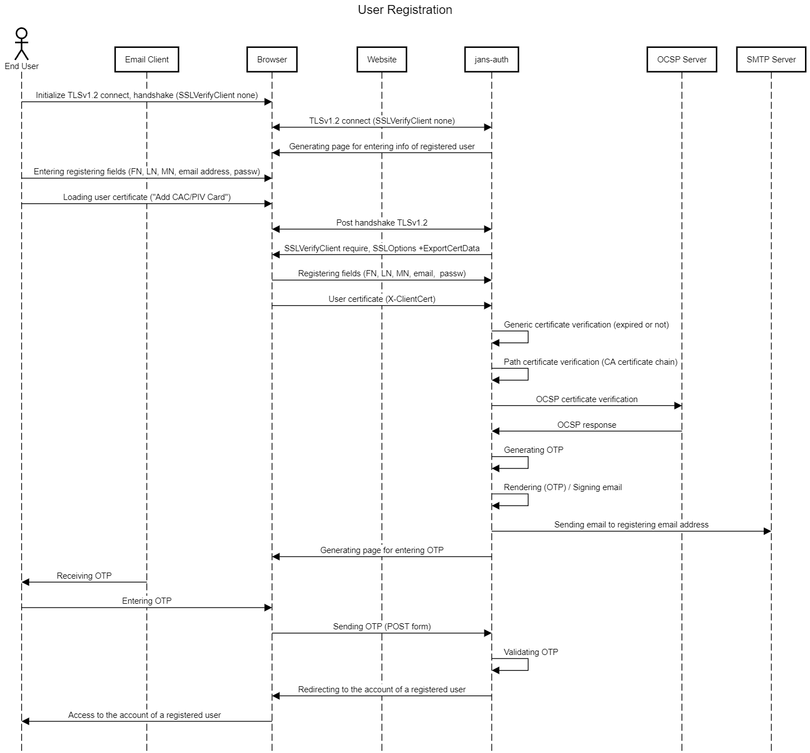

# Zero Trust Framework Documentation (Janssen Server Customizing)  

Zero Trust Demo for Jans with OpenID

# Table of Contents


The purpose of the Zero Trust Framework (customizing) is to centralize authentication,
to enable Single Sign-on (SSO), and to provide a web portal to enable end-users to
view and manage their two-factor credentials. Diagram 1 provides an overview of
how federated SSO works. In this example, an End User starts his web browser,
navigates to the Training Website, and initiates a Login event. The Browser is
redirected to the Janssen Server, which returns the Login Page. After
authentication, the Training Website can obtain an Identity Assertion from the
Janssen Server which details the authentication event (e.g. who authenticated, when
they authenticated, how they authenticated), user claims (e.g. first name, last
name, role, email address, etc), and an access token (which the website can
present to other services to convey permissions). The End User can visit Casa to
enroll additional credentials or to register an email address or SMS phone
number.

## Use Cases

### Registration

1. **Register for new account with CAC/PIV card**  If a person has a smart card,
they can present it during the registration process, and we should pick up the
subject DN which has their name and `edipi`.
1. **Register for new account (no CAC/PIV card)**  If the person does not
yet have a CAC/PIV card, we should enroll email and an SMS number.
1. **Associate a CAC card against existing account**  This use case is possible
when a person registered before they obtained a CAC/PIV, and then want to
associate their smart card with their account.
1. **Confirmation of OTP to verify email address**
   1. Email OTP should expire after 15 minutes
   1. An admin can disable OTP email confirmation
1. **Sponsor Approval**  In this use case, an authorized person logs into Casa
to see a list of people who enrolled. They must then approve each registration
manually.
1. **Registration for account with duplicate email** Do not allow.
1. **Required fields for registration**
1. **CAPTCHA**
1. **Password strength algorithm** Password policy should be customized.  
Example of some implemented password policy:  
"The minimum password length is 15 characters, containing at least one lowercase letter,
one uppercase letter, one number, and one special character".
1. **Valid email domain validation**.
1. **Disable automatic account enablement**  The Janssen Server admin can
restrict enrollment to certain domains.
1. **Redirect from Smart Card Login for unregistered person**.
1. **Signed Verification email** The Janssen Server must sign emails.

### Authentication

1. **email identifier** The end-user's email address is used for identification
(i.e. the email is the username).
1. **Smart Card**  The end user clicks on a button, which should prompt their
browser to enable the selection of an X.509 certificate.
1. **SMS**  After successful password authentication, and SMS message is sent
with a one time code, which the person must enter within a certain timeframe.
1. **Email**  After successful password authentication, an email is sent with a
one time code, which the person must enter within a certain timeframe.
1. **Forgot Password** An end user can trigger an email to reset their password.
1. **Email** Janssen Server sends a signed email to a person's email account.

### Credential Management

1. **Smart Card** The end user should be able to enroll a CAC/PIV card, and to
view the details of an associated X.509 certificate.
1. **SMS**  The end user should be able to view, add, and remove an associated
phone number to receive SMS notifications.
1. **Email** The end user should be able to view, add, and remove an associated
email account (as long as the domain is allowed).
1. **Change Password** End users should be able to change their password,
provided the new password meets the associated password complexity.

### Audit Logging

An audit log of all session activity should be stored in the LDAP server, under
the `o=metric` suffix. A sample record is here:

```text
dn=uniqueIdentifier={guid},ou={year-month},ou=audit,o=metric
objectclass: top
objectclass: oxMetric
uniqueIdentifier: {guid}
oxMetricType: audit
creationDate: {timestamp}
oxApplicationType: client_id
oxData: {“uid”:”foobar”,
          “edipi”:”1234567”,
          “type”: “startSession”,
          "redirect_uri": "https://abc.xyz/cb"
          "ip": "10.10.10.10",
          "acr": "smartcard",
          "session_id": "1234"}

```

### Restrict to single sessions

The Janssen Server should only allow an end-user to have one active session (web
or mobile). If an end-user logs in, previous sessions should be terminated in
the Janssen Server. Note: this does not imply that all applications will logout the
end-user at that time. However, if an OpenID Relying Party attempts to obtain a
token after the session has been revoked, the Janssen Server will re-authenticated
the person.

### Logout

1. **Logout from Casa**  On hitting the logout button, the person's browser
should logout.
1. **Logout from OpenID Connect relying party (RP)**  Provided the RP has a
properly configured OpenID Connect client in the Janssen Server, and that it makes
the correct front-channel logout call, the Person's browser should be logged out
of the website.

### User expiration

1. Users who do not login for ___ days should be removed from the system and
forced to re-register.  

# Installation

## RHEL 8 installation

### Base installation with DISA STIG Security Profile

If you are installing RHEL 8 from media:

* Under Software Selection, select `Minimal Install`

* Under Security Policy, select the `DISA STIG Security Policy`

* Enable networking and assign an **FQDN** hostname.

* Set the timezone

* Add a user with admin privileges (not `root`)

* You will need to create a custom disk layout. The following folders must be on
a separate partition or logical volume:

| mount point | Size |
| ----------- |------|
|`/tmp`| 1G|
|`/boot`| 500M|
|`/boot/efi`| 2G|
|`/home`| 3G|
|`/var`| 5G|
|`/var/log`| 3G|
|`/var/log/audit`| 2G|
|`/var/tmp`| 1G|
|`swap`| RAM Size|
|`/`| (the rest of the space)|

If you are using a cloud image, you can also apply the
[DISA-STIG](https://github.com/RedHatGov/rhel8-stig-latest)
settings by running the shell script provided by Red Hat,
`# bash rhel8-script-stig.sh`, and then rebooting.

### RHEL 8 Server Firewall

The RHEL 8 system firewall should be running. You can check with this
command:

```bash
systemctl status firewalld
```

Open the `https` and `http` service for public access (http just
redirects to https, but opening it prevents some user confusion)

```bash
firewall-cmd --zone=public --permanent --add-service=https
firewall-cmd --zone=public --permanent --add-service=http
```

```bash
firewall-cmd --reload
```

To get the current state of the firewall:

```bash
firewall-cmd --list-all
```

## Janssen Server Installation

This initial base configuration happens on Server 1-1. After the configuration
of 1-1 is complete, you will initialize the other servers.

### Install Janssen GPG Key

* Download **Janssen** key:

```bash
wget https://repo.gluu.org/rhel/RPM-GPG-KEY-GLUU -O /etc/pki/rpm-gpg/RPM-GPG-KEY-GLUU
```

* Install **Janssen** key:

```bash
rpm --import /etc/pki/rpm-gpg/RPM-GPG-KEY-GLUU
```

* List of installed public keys:

```bash
rpm -qa gpg-pubkey*
```

* Get info about installed **Janssen** key:

```bash
rpm -qi gpg-pubkey-0544ba38-572aa647
```

### Install Janssen Server RPM

### Janssen Server setup

### Janssen Server Verification

1. Check the version of the installed Jannsen components

```bash
python3 ./show_version.py

Title: jans-config-api-server-fips
Version: 1.0.7-SNAPSHOT
Builddate:
Build: a798e35dcf82de58a75d2299639b355300a79042

Title: SCIM API Server (FIPS)
Version: 1.0.7-SNAPSHOT
Builddate:
Build: a798e35dcf82de58a75d2299639b355300a79042

Title: Fido2 API Server (FIPS)
Version: 1.0.7-SNAPSHOT
Builddate:
Build: a798e35dcf82de58a75d2299639b355300a79042

Title: Jans authentication server (FIPS)
Version: 1.0.7-SNAPSHOT
Builddate:
Build: a798e35dcf82de58a75d2299639b355300a79042
```

1. Verify Janssen Server Access

* use these configuration endpoints for checking access:

[Auth Server / Authorization](https://docs.jans.io/v1.0.7/admin/auth-server/endpoints/authorization/)  
[Auth Server / Crypto Keys](https://docs.jans.io/v1.0.7/admin/auth-server/crypto/keys/)  

* use these admin tools for checking access:

[jans-cli Module Command line Admin Tool](https://docs.jans.io/v1.0.7/admin/config-guide/tui/)  
[jans_cli_tui Text User Interface Admin Tool](https://docs.jans.io/v1.0.7/admin/config-guide/tui/)  

<dl>
  <dt>Note:</dt>
  <dd>You need to allow https in the RHEL system firewall. You should
  have done this already (see above.)</dd>
</dl>

## PostgreSQL Server Configuration

## jans-auth configuration

### jans-auth properties

Make these changes to the default jans-auth JSON configuration properties:

* `claimsParameterSupported` : `False`
* `disableU2fEndpoint` : `True`
* `bruteForceProtectionEnabled` : `True`

### Custom assets

* For installing assets use script **ztrust_install_jans_auth_assets.py**:

```bash
python3 ./ztrust_install_jans_auth_assets.py --help

Usage: ztrust_install_jans_auth_assets.py [options]

Options:
  -h, --help            show this help message and exit
  -i IN_ARCH_FPATH, --in_arch_fpath=IN_ARCH_FPATH
                        input archive file path (default: 'zero-trust-demo-main.zip')
  -o OUT_BASE_DPATH, --out_base_dpath=OUT_BASE_DPATH
                        base output directory path (default: '/opt/jans')
```

During installing, set of resources (templates, images,...) will be extracted from archive and
and will be deployed to gluu diorectory (default: **/opt/jans**).

* Restart jans-auth

```bash
systemctl restart jans-auth  
```

### jans-auth Email 2FA Script

This script asks the user to enter a password in step 1, sends a signed
email to the user with an OTP, and asks the user to enter the OTP in step 2.

```text
title Email OTP Authenticaiton

actor End User
participant Email Client
participant Browser
participant Website
participant Janssen
participant SMTP Server

jans-auth->Browser: Generating page for entering of user login
End User->Website: Initiating login
Website->Browser: Redirecting
Browser<->jans-auth: Page 1: identifier / password

jans-auth->jans-auth: Generating OTP
jans-auth->jans-auth: Rendering / Generating signed email
jans-auth->SMTP Server: Sending email
jans-auth->Browser: Diplay Page 2: Enter OTP
Email Client->End User: Receiving OTP
End User->Browser: Entering OTP
Browser->jans-auth: Sending OTP (POST form)
jans-auth->jans-auth: Validating OTP
jans-auth->Browser: Redirecting to website
Browser->Website: ... Continue with OpenID Code Flow
Website<->Browser: HTTP/HTTPS requests/responces
Browser<->End User: Website content
```

#### Generating private keys and certificates for signing emails

The Email 2FA Script needs a private key to sign the email. The example
`keytool` commands show how to generate a self-signed certificate and
certificate signing request (CSR) for several different key formats. In a
production deployment, you would only need to choose one signature algorithm.

***

| | |
|---|---|
|RSA Signature|**RSA**|
|Key length|**2048**|
|Signature alg|**SHA256withRSA**|

* self-signed

```bash
keytool -genkey -alias EmailSigner-RSA -keyalg RSA -keysize 2048 -sigalg SHA256withRSA \
  -dname "CN=SMTP CA Certificate" -validity 365 -storetype bcfks \
  -keystore /etc/certs/gluuEmailSigner.bcfks \
  -keypass xxxxxxxx -storepass xxxxxxxx \
  -providername BCFIPS -providerclass org.bouncycastle.jcajce.provider.BouncyCastleFipsProvider \
  -providerpath /var/gluu/dist/app/bc-fips-1.0.2.3.jar:/var/gluu/dist/app/bcpkix-fips-1.0.6.jar
```

* CSR

```bash
keytool -certreq -alias EmailSigner-RSA \
-keystore /etc/certs/gluuEmailSigner.bcfks \
-storetype bcfks -keyalg ec -file ./gluuEmailSigner.csr \
-keypass ******* -storepass ******* -providername BCFIPS \
-provider org.bouncycastle.jcajce.provider.BouncyCastleFipsProvider \
-providerpath /var/gluu/dist/app/bc-fips-1.0.2.3.jar:/var/gluu/dist/app/bcpkix-fips-1.0.6.jar
```

***

| | |
|---|---|
|ECDSA Signature, curve| **secp256r1** (**NIST P-256**)|
|Key length| **256**|
|Signature alg|**SHA256withECDSA**|

* Self-Signed

```bash
keytool -genkeypair -alias EmailSigner-EC -keyalg EC -groupname secp256r1
-sigalg SHA256withECDSA -dname "CN=SMTP CA Certificate" -validity 365
-storetype bcfks -keystore /etc/certs/gluuEmailSigner.bcfks \
-keypass xxxxxxxx -storepass xxxxxxxx -providername \
BCFIPS -providerclass org.bouncycastle.jcajce.provider.BouncyCastleFipsProvider \
-providerpath /var/gluu/dist/app/bc-fips-1.0.2.3.jar:/var/gluu/dist/app/bcpkix-fips-1.0.6.jar
```

* CSR

```bash
keytool -certreq -alias EmailSigner-EC \
-keystore /etc/certs/gluuEmailSigner.bcfks \
-storetype bcfks -keyalg ec -file ./gluuEmailSigner.csr \
-keypass ******* -storepass ******* -providername BCFIPS \
-provider org.bouncycastle.jcajce.provider.BouncyCastleFipsProvider \
-providerpath /var/gluu/dist/app/bc-fips-1.0.2.3.jar:/var/gluu/dist/app/bcpkix-fips-1.0.6.jar
```

***

| | |
|---|---|
|EDDSA Signature, curve|**Ed25519**|
|Key length|**256**|
|Signature alg|**Ed25519**|

* Self Signed

```bash
keytool -genkeypair -alias EmailSigner-Ed25519 -keyalg Ed25519 -sigalg Ed25519 \
  -dname "CN=SMTP CA Certificate" -validity 365 -storetype bcfks \
  -keystore /etc/certs/gluuEmailSigner.bcfks \
  -keypass xxxxxxx -storepass xxxxxxx \
  -providername BCFIPS -providerclass org.bouncycastle.jcajce.provider.BouncyCastleFipsProvider \
  -providerpath /var/gluu/dist/app/bc-fips-1.0.2.3.jar:/var/gluu/dist/app/bcpkix-fips-1.0.6.jar
```

* CSR

```bash
keytool -certreq -alias EmailSigner-Ed25519 \
-keystore /etc/certs/gluuEmailSigner.bcfks \
-storetype bcfks -keyalg ec -file ./gluuEmailSigner.csr \
-keypass ******* -storepass ******* -providername BCFIPS \
-provider org.bouncycastle.jcajce.provider.BouncyCastleFipsProvider \
-providerpath /var/gluu/dist/app/bc-fips-1.0.2.3.jar:/var/gluu/dist/app/bcpkix-fips-1.0.6.jar
```

***

| | |
|---|---|
|EDDSA Signature, curve|**Ed448**|
|Key length|**465**|
|SiGnature alg|**Ed448**|

* Self Signed

```bash
keytool -genkeypair -alias EmailSigner-Ed448 -keyalg Ed448 -sigalg Ed448 \
  -dname "CN=SMTP CA Certificate" -validity 365 -storetype bcfks \
  -keystore /etc/certs/gluuEmailSigner.bcfks \
  -keypass xxxxxxxx -storepass xxxxxxxx \
  -providername BCFIPS -providerclass org.bouncycastle.jcajce.provider.BouncyCastleFipsProvider \
  -providerpath /var/gluu/dist/app/bc-fips-1.0.2.3.jar:/var/gluu/dist/app/bcpkix-fips-1.0.6.jar
```

* CSR

```bash
keytool -certreq -alias EmailSigner-Ed448 \
-keystore /etc/certs/gluuEmailSigner.bcfks \
-storetype bcfks -keyalg ec -file ./gluuEmailSigner.csr \
-keypass ******* -storepass ******* -providername BCFIPS \
-provider org.bouncycastle.jcajce.provider.BouncyCastleFipsProvider \
-providerpath /var/gluu/dist/app/bc-fips-1.0.2.3.jar:/var/gluu/dist/app/bcpkix-fips-1.0.6.jar
```

***

* Change the ownership of the keystore so it can be read by jans-auth

```bash
chgrp gluu /etc/certs/gluuEmailSigner.bcfks
```

```bash
chmod g+r /etc/certs/gluuEmailSigner.bcfks
```

* You can check the certificate:

```bash
keytool -list -v -keystore /etc/certs/gluuEmailSigner.bcfks -storetype BCFKS \
  -keypass xxxxxxxx \
  -storepass xxxxxxxx \
  -providername BCFIPS \
  -provider org.bouncycastle.jcajce.provider.BouncyCastleFipsProvider \
  -providerpath /var/gluu/dist/app/bc-fips-1.0.2.3.jar:/var/gluu/dist/app/bcpkix-fips-1.0.6.jar
```

#### Properties of Email 2FA Script

Navigate to  *Configuration --> Person Authentication Scripts*, scroll to the
bottom of the page and click **Add custom script configuration**

* Specify the name as `ztrust-email_2fa_plugin` and add these properties:

|key                            | optional                    | value                                       |
|------------------------------ | --------------------------- | ------------------------------------------- |
|SCRIPT_FUNCTION                | yes (default: email_2fa)    | email_2fa                                   |
|token_length                   | no                          | 7                                           |
|token_lifetime                 | no                          | 15                                          |
|Signer_Cert_Alias              | yes (default: value from    | signer                                      |
|                               | SMTP properties )           |                                             |
|Signer_Cert_KeyStore           | yes (default: value from    | gluuEmailSigner.bcfks                       |
|                               | SMTP properties )           |                                             |  
|Signer_Cert_KeyStorePassword   | yes (default: value from    | *******                                     |
|                               | SMTP properties )           |                                             |  
|Signer_SignAlgorithm           | yes (default: value from    | SHA256withECDSA                             |
|                               | SMTP properties )           |                                             |  
|email_templates_json_file_path | no                          | /etc/gluu/conf/ztrust-email-email_2fa.json    |
|regex_json_file_path           | no                          | /etc/gluu/conf/ztrust-regex.json              |

* Copy and paste the text of `email_2fa_plugin.py` into the *Script* text area.

* Don't forget to check *Enabled* and click **Update**.

### jans-auth Forgot Password Script


```text
title Password Recovery (forgot_password.py)

actor End User
participant Email Client
participant Browser
participant jans-auth
participant SMTP Server

jans-auth->Browser: Generating page for entering of user email address
End User->Browser: Entering user email address
Browser->jans-auth: Sending email address (POST form)
jans-auth->jans-auth: Generating OTP
jans-auth->jans-auth: Rendering (OTP) / Signing email
jans-auth->SMTP Server: Sending email to registering email address
jans-auth->Browser: Generating page for entering OTP
Email Client->End User: Receiving OTP
End User->Browser: Entering OTP
Browser->jans-auth: Sending OTP (POST form)
jans-auth->Browser: Redirecting to the account of a registered user
Browser->End User: Access to the account of a registered user  
```

* Navigate to  *Configuration --> Person Authentication Scripts*, scroll
to the bottom of the page and click **Add custom script configuration**

* Specify the name as `ztrust-forgot_password` and add these properties:

|key                            | optional                        | value                                           |
|------------------------------ | ------------------------------- | ----------------------------------------------- |
|SCRIPT_FUNCTION                | yes (default: forgot_password)  | forgot_password                                 |
|token_length                   | no                              | 7                                               |
|token_lifetime                 | no                              | 15                                              |
|Signer_Cert_Alias              | yes (default: value from        | signer                                          |
|                               | SMTP properties )               |                                                 |
|Signer_Cert_KeyStore           | yes (default: value from        | gluuEmailSigner.bcfks                           |
|                               | SMTP properties )               |                                                 |  
|Signer_Cert_KeyStorePassword   | yes (default: value from        | *******                                         |
|                               | SMTP properties )               |                                                 |  
|Signer_SignAlgorithm           | yes (default: value from        | SHA256withECDSA                                 |  
|                               | SMTP properties )               |                                                 |  
|Signer_SignAlgorithm           | yes (default: value from        | SHA256withECDSA                                 |  
|                               | SMTP properties )               |                                                 |  
|email_templates_json_file_path | no                              | /etc/gluu/conf/ztrust-email-forgot_password.json  |  
|attributes_json_file_path      | no                              | /etc/gluu/conf/ztrust-attributes.json             |  
|regex_json_file_path           | no                              | /etc/gluu/conf/ztrust-regex.json                  |  

**attributes_json_file_path**:

Example of the attributes json file (defined by **attributes_json_file_path**):

```json
    {
        "ids": [
                "givenName",
                "sn",
                "familyName",
                "certificate",
                "captcha_elem"
            ],

        "passStrength": 2
    }
```

, where:  
**"ids"** - arrays of IDs of elements, that should be used, by **reg.xhtml**, **regtr.xhtml** pages;  
        here is the array, that contains all possible IDs:  

```text
    var allIds = [
        "givenName",
        "familyName",
        "sn",
        "certificate",
        "captcha_elem"
    ];
```

;  
You can customize array "ids", using necessary IDs, that should be filled/defined during registering;  
    "passStrength" - **Password Strength**;  
    There are follow levels:  

```text
            var strength = {
                0: "Worst ",
                1: "Bad ",
                2: "Weak ",
                3: "Good ",
                4: "Strong ",
            };
```

**"passStrength"** defines lower level of a password strength, that can be approved on pages: **reg.xhtml**, **regtr.xhtml**.  

**regex_json_file_path**:

Example of the attributes json file (defined by **regex_json_file_path**):

```json
{
    "mail_regex": "^[a-zA-Z0-9\\.\\!\\#\\$\\%\\&\\'\\*\\+\\\\\/\\=\\?\\^\\_\\`\\{\\|\\}\\~\\-]+@(?:[a-zA-Z0-9]){1}(?:[a-zA-Z0-9-]{0,61}[a-zA-Z0-9])?(?:\\.[a-zA-Z0-9](?:[a-zA-Z0-9-]{0,61}[a-zA-Z0-9])?)*$",
    "pass_regex": "^(?=.*[a-z])(?=.*[A-Z])(?=.*\\d)(?=.*[\\~\\`\\!\\@\\#\\$\\%\\^\\&\\*\\(\\)\\-\\_\\+\\=\\{\\}\\[\\]\\|\\\\\/\\:\\;\\\"\\'\\<\\>\\,\\.\\?])[A-Za-z\\d\\~\\`\\!\\@\\#\\$\\%\\^\\&\\*\\(\\)\\-\\_\\+\\=\\{\\}\\[\\]\\|\\\\\/\\:\\;\\\"\\'\\<\\>\\,\\.\\?]{15,}$"
}
```

, where:  
**"mail_regex"** - regular expression, that defines requiremets to an email, entered on pages: **reg.xhtml**, **regtr.xhtml**;  
For example, if we have follow requirement:  

```text
        **Valid email domain validation**
```

then follow "mail_regex" value should be used:  

```text
        ^[a-zA-Z0-9\.\!\#\$\%\&\'\*\+\\\/\=\?\^\_\`\{\|\}\~\-]+@(?:[a-zA-Z0-9]){1}(?:[a-zA-Z0-9-]{0,61}[a-zA-Z0-9])?(?:\.[a-zA-Z0-9](?:[a-zA-Z0-9-]{0,61}[a-zA-Z0-9])?)*$
```

;  
this value should be updated to follow format in attributes json file:  

```text
        ^[a-zA-Z0-9\\.\\!\\#\\$\\%\\&\\'\\*\\+\\\\\/\\=\\?\\^\\_\\`\\{\\|\\}\\~\\-]+@(?:[a-zA-Z0-9]){1}(?:[a-zA-Z0-9-]{0,61}[a-zA-Z0-9])?(?:\\.[a-zA-Z0-9](?:[a-zA-Z0-9-]{0,61}[a-zA-Z0-9])?)*$
```

;  
**"pass_regex"** - regular expression, that defines additional requiremets to a password, entered on pages **reg.xhtml**, **regtr.xhtml**;  
For example, if we have follow requirement:  

```text
**Password strength algorithm**  The minimum password length is 15
characters, containing at least one lowercase letter, one uppercase letter, one
number, and one special character.
```

then follow "pass_regex" value should be used:  

```text
        ^(?=.*[a-z])(?=.*[A-Z])(?=.*\d)(?=.*[\~\`\!\@\#\$\%\^\&\*\(\)\-\_\+\=\{\}\[\]\|\\\/\:\;\"\'\<\>\,\.\?])[A-Za-z\d\~\`\!\@\#\$\%\^\&\*\(\)\-\_\+\=\{\}\[\]\|\\\/\:\;\"\'\<\>\,\.\?]{15,}$
```  

this value should be updated to follow format  in attributes json file:  

```text
        ^(?=.*[a-z])(?=.*[A-Z])(?=.*\\d)(?=.*[\\~\\`\\!\\@\\#\\$\\%\\^\\&\\*\\(\\)\\-\\_\\+\\=\\{\\}\\[\\]\\|\\\\\/\\:\\;\\\"\\'\\<\\>\\,\\.\\?])[A-Za-z\\d\\~\\`\\!\\@\\#\\$\\%\\^\\&\\*\\(\\)\\-\\_\\+\\=\\{\\}\\[\\]\\|\\\\\/\\:\\;\\\"\\'\\<\\>\\,\\.\\?]{15,}$
```

.

File **regex_json_file_path** can be updated manually or using plug-in **passw-policy_plugin**.

**email_templates_json_file_path**:

This file contains parameters, which are used, during generation of validation email (this email will contain **OTP**).

Example of the attributes json file (defined by **email_templates_json_file_path**):

```json
{
    "email_subject": "Gluu Authentication Token",
    "email_msg_template": "Here is your token : %%otp%%"
}
```

, where:  
**"email_subject"** - text of email subject, that is sent, during registration;  
**"email_msg_template"** - template of text of email;

This template can use follow variables:

**%%otp%%** - OTP (one-time password/code).  

**attributes_json_file_path**:

Example of the attributes json file (defined by **attributes_json_file_path**):

```json
    {
        "ids": [
                "givenName",
                "sn",
                "familyName",
                "certificate",
                "captcha_elem"
            ],

        "passStrength": 2
    }
```

, where:  
**"ids"** - arrays of IDs of elements, that should be used, by **reg.xhtml**, **regtr.xhtml** pages;  
        here is the array, that contains all possible IDs:  

```text
    var allIds = [
        "givenName",
        "familyName",
        "sn",
        "certificate",
        "captcha_elem"
    ];
```

;  
You can customize array "ids", using necessary IDs, that should be filled/defined during registering;  
    "passStrength" - **Password Strength**;  
    There are follow levels:  

```text
            var strength = {
                0: "Worst ",
                1: "Bad ",
                2: "Weak ",
                3: "Good ",
                4: "Strong ",
            };
```

**"passStrength"** defines lower level of a password strength, that can be approved on pages: **reg.xhtml**, **regtr.xhtml**.  

**regex_json_file_path**:

Example of the attributes json file (defined by **regex_json_file_path**):

```json
{
    "mail_regex": "^[a-zA-Z0-9\\.\\!\\#\\$\\%\\&\\'\\*\\+\\\\\/\\=\\?\\^\\_\\`\\{\\|\\}\\~\\-]+@(?:[a-zA-Z0-9]){1}(?:[a-zA-Z0-9-]{0,61}[a-zA-Z0-9])?(?:\\.[a-zA-Z0-9](?:[a-zA-Z0-9-]{0,61}[a-zA-Z0-9])?)*$",
    "pass_regex": "^(?=.*[a-z])(?=.*[A-Z])(?=.*\\d)(?=.*[\\~\\`\\!\\@\\#\\$\\%\\^\\&\\*\\(\\)\\-\\_\\+\\=\\{\\}\\[\\]\\|\\\\\/\\:\\;\\\"\\'\\<\\>\\,\\.\\?])[A-Za-z\\d\\~\\`\\!\\@\\#\\$\\%\\^\\&\\*\\(\\)\\-\\_\\+\\=\\{\\}\\[\\]\\|\\\\\/\\:\\;\\\"\\'\\<\\>\\,\\.\\?]{15,}$"
}
```

, where:  
**"mail_regex"** - regular expression, that defines requiremets to an email, entered on pages: **reg.xhtml**, **regtr.xhtml**;  
For example, if we have follow requirement:  

```text
        **Valid email domain validation**
```

then follow "mail_regex" value should be used:  

```text
        ^[a-zA-Z0-9\.\!\#\$\%\&\'\*\+\\\/\=\?\^\_\`\{\|\}\~\-]+@(?:[a-zA-Z0-9]){1}(?:[a-zA-Z0-9-]{0,61}[a-zA-Z0-9])?(?:\.[a-zA-Z0-9](?:[a-zA-Z0-9-]{0,61}[a-zA-Z0-9])?)*$
```

;  
this value should be updated to follow format in attributes json file:  

```text
        ^[a-zA-Z0-9\\.\\!\\#\\$\\%\\&\\'\\*\\+\\\\\/\\=\\?\\^\\_\\`\\{\\|\\}\\~\\-]+@(?:[a-zA-Z0-9]){1}(?:[a-zA-Z0-9-]{0,61}[a-zA-Z0-9])?(?:\\.[a-zA-Z0-9](?:[a-zA-Z0-9-]{0,61}[a-zA-Z0-9])?)*$
```

;  
**"pass_regex"** - regular expression, that defines additional requiremets to a password, entered on pages **reg.xhtml**, **regtr.xhtml**;  
For example, if we have follow requirement:  

```text
**Password strength algorithm**  The minimum password length is 15
characters, containing at least one lowercase letter, one uppercase letter, one
number, and one special character.
```

then follow "pass_regex" value should be used:  

```text
        ^(?=.*[a-z])(?=.*[A-Z])(?=.*\d)(?=.*[\~\`\!\@\#\$\%\^\&\*\(\)\-\_\+\=\{\}\[\]\|\\\/\:\;\"\'\<\>\,\.\?])[A-Za-z\d\~\`\!\@\#\$\%\^\&\*\(\)\-\_\+\=\{\}\[\]\|\\\/\:\;\"\'\<\>\,\.\?]{15,}$
```  

this value should be updated to follow format  in attributes json file:  

```text
        ^(?=.*[a-z])(?=.*[A-Z])(?=.*\\d)(?=.*[\\~\\`\\!\\@\\#\\$\\%\\^\\&\\*\\(\\)\\-\\_\\+\\=\\{\\}\\[\\]\\|\\\\\/\\:\\;\\\"\\'\\<\\>\\,\\.\\?])[A-Za-z\\d\\~\\`\\!\\@\\#\\$\\%\\^\\&\\*\\(\\)\\-\\_\\+\\=\\{\\}\\[\\]\\|\\\\\/\\:\\;\\\"\\'\\<\\>\\,\\.\\?]{15,}$
```

.

File **regex_json_file_path** can be updated manually or using plug-in **passw-policy_plugin**.

**email_templates_json_file_path**:

This file contains parameters, which are used, during generation of validation email (this email will contain **OTP**).

Example of the attributes json file (defined by **email_templates_json_file_path**):

```json
{
    "email_subject": "Gluu Authentication Token",
    "email_msg_template": "Here is your token : %%otp%%"
}
```

, where:  
**"email_subject"** - text of email subject, that is sent, during registration;  
**"email_msg_template"** - template of text of email;

This template can use follow variables:

**%%otp%%** - OTP (one-time password/code).  

* Copy and paste the text of `forgot_password.py` into the *Script* text area.

* Don't forget to check *Enabled* and click **Update**.

### jans-auth User Registration Script



```text
title User Registration (register.py)

actor End User
participant Email Client
participant Browser
participant Website
participant jans-auth
participant OCSP Server
participant SMTP Server

End User->Browser: Initialize TLSv1.2 connect, handshake (SSLVerifyClient none)
Browser<->jans-auth: TLSv1.2 connect (SSLVerifyClient none)
jans-auth->Browser: Generating page for entering info of registered user
End User->Browser: Entering registering fields (FN, LN, MN, email address, passw)
End User->Browser: Loading user certificate ("Add CAC/PIV Card")
Browser<->jans-auth: Post handshake TLSv1.2
Browser<-jans-auth: SSLVerifyClient require, SSLOptions +ExportCertData
Browser->jans-auth: Registering fields (FN, LN, MN, email,  passw)
Browser->jans-auth: User certificate (X-ClientCert)
jans-auth->jans-auth: Generic certificate verification (expired or not)
jans-auth->jans-auth: Path certificate verification (CA certificate chain)
jans-auth->OCSP Server: OCSP certificate verification
OCSP Server->jans-auth: OCSP response
jans-auth->jans-auth: Generating OTP
jans-auth->jans-auth: Rendering (OTP) / Signing email
jans-auth->SMTP Server: Sending email to registering email address
jans-auth->Browser: Generating page for entering OTP
Email Client->End User: Receiving OTP
End User->Browser: Entering OTP
Browser->jans-auth: Sending OTP (POST form)
jans-auth->jans-auth: Validating OTP
jans-auth->Browser: Redirecting to the account of a registered user
Browser->End User: Access to the account of a registered user  
```

* Navigate to  *Configuration --> Person Authentication Scripts*, scroll
to the bottom of the page and click **Add custom script configuration**

* Specify the Name as `ztrust-register` and add these properties:

|key                          | value               |
|---------------------------- | ------------------- |
| attributes_json_file_path |  |
| regex_json_file_path |  |
| email_templates_json_file_path |  |
| crl_max_response_size |  specifies the maximum allowed size of [CRL] response. |
| use_crl_validator |  enable/disable specific certificate validation.  |
| use_generic_validator |  enable/disable specific certificate validation  |
| use_ocsp_validator |  enable/disable specific certificate validation.  |
| use_path_validator |  enable/disable specific certificate validation.  |
| chain_cert_file_path |  mandatory property pointing to certificate chains in [PEM] format.  |
| token_length |  Determines the length of the characters of the OTP sent to the user. |
| token_lifetime | Determines the time period for which the sent token is active. |
| Signer_Cert_Alias |  Alias of the keystore. |
| Signer_Cert_KeyStorePassword |  keystore password. |
| Signer_Cert_KeyStore | Filename of the keystore. |
| Signer_SignAlgorithm | Signature Algorithm. |
| Enable_User |  Enables User account registration if true. |
| Require_Email_Confirmation | If set, an OTP is sent before activating the registration. |

**use_generic_validator** - if this property is **true**, common check of client certificate (that checked certificate is not exprired) is provided;  
**use_path_validator** - if this property is **true**, certificate path (validity of CA(s) of certificate) is provided;  
**use_ocsp_validator** - if this property is **true**, OCSP check of client certificate (OCSP info (URI,...) is extracted is checked certificate) is provided;  
**use_crl_validator** - CLR lists are not used by ZTrust, so **false** value should be used;  

**attributes_json_file_path**:

Example of the attributes json file (defined by **attributes_json_file_path**):

```json
    {
        "ids": [
        "givenName",
        "sn",
        "familyName",
        "certificate",
        "captcha_elem"
        ],

        "passStrength": 2,
    }
```

, where:  
**"ids"** - arrays of IDs of elements, that should be used, by **reg.xhtml**, **regtr.xhtml** pages;  
        here is the array, that contains all possible IDs:  

```text
    var allIds = [
        "givenName",
        "familyName",
        "sn",
        "certificate",
        "captcha_elem"
    ];
```

;  
You can customize array "ids", using necessary IDs, that should be filled/defined during registering;  
    "passStrength" - **Password Strength**;  
    There are follow levels:  

```text
            var strength = {
                0: "Worst ",
                1: "Bad ",
                2: "Weak ",
                3: "Good ",
                4: "Strong ",
            };
```

**"passStrength"** defines lower level of a password strength, that can be approved on pages: **reg.xhtml**, **regtr.xhtml**.  

**regex_json_file_path**:

Example of the attributes json file (defined by **regex_json_file_path**):

```json
{
    "mail_regex": "^[a-zA-Z0-9\\.\\!\\#\\$\\%\\&\\'\\*\\+\\\\\/\\=\\?\\^\\_\\`\\{\\|\\}\\~\\-]+@(?:[a-zA-Z0-9]){1}(?:[a-zA-Z0-9-]{0,61}[a-zA-Z0-9])?(?:\\.[a-zA-Z0-9](?:[a-zA-Z0-9-]{0,61}[a-zA-Z0-9])?)*$",
    "pass_regex": "^(?=.*[a-z])(?=.*[A-Z])(?=.*\\d)(?=.*[\\~\\`\\!\\@\\#\\$\\%\\^\\&\\*\\(\\)\\-\\_\\+\\=\\{\\}\\[\\]\\|\\\\\/\\:\\;\\\"\\'\\<\\>\\,\\.\\?])[A-Za-z\\d\\~\\`\\!\\@\\#\\$\\%\\^\\&\\*\\(\\)\\-\\_\\+\\=\\{\\}\\[\\]\\|\\\\\/\\:\\;\\\"\\'\\<\\>\\,\\.\\?]{15,}$"
}
```

, where:  
**"mail_regex"** - regular expression, that defines requiremets to an email, entered on pages: **reg.xhtml**, **regtr.xhtml**;  
For example, if we have follow requirement:  

```text
        **Valid email domain validation**
```

then follow "mail_regex" value should be used:  

```text
        ^[a-zA-Z0-9\.\!\#\$\%\&\'\*\+\\\/\=\?\^\_\`\{\|\}\~\-]+@(?:[a-zA-Z0-9]){1}(?:[a-zA-Z0-9-]{0,61}[a-zA-Z0-9])?(?:\.[a-zA-Z0-9](?:[a-zA-Z0-9-]{0,61}[a-zA-Z0-9])?)*$
```

;  
this value should be updated to follow format in attributes json file:  

```text
        ^[a-zA-Z0-9\\.\\!\\#\\$\\%\\&\\'\\*\\+\\\\\/\\=\\?\\^\\_\\`\\{\\|\\}\\~\\-]+@(?:[a-zA-Z0-9]){1}(?:[a-zA-Z0-9-]{0,61}[a-zA-Z0-9])?(?:\\.[a-zA-Z0-9](?:[a-zA-Z0-9-]{0,61}[a-zA-Z0-9])?)*$
```

;  
**"pass_regex"** - regular expression, that defines additional requiremets to a password, entered on pages **reg.xhtml**, **regtr.xhtml**;  
For example, if we have follow requirement:  

```text
**Password strength algorithm**  The minimum password length is 15
characters, containing at least one lowercase letter, one uppercase letter, one
number, and one special character.
```

then follow "pass_regex" value should be used:  

```text
        ^(?=.*[a-z])(?=.*[A-Z])(?=.*\d)(?=.*[\~\`\!\@\#\$\%\^\&\*\(\)\-\_\+\=\{\}\[\]\|\\\/\:\;\"\'\<\>\,\.\?])[A-Za-z\d\~\`\!\@\#\$\%\^\&\*\(\)\-\_\+\=\{\}\[\]\|\\\/\:\;\"\'\<\>\,\.\?]{15,}$
```  

this value should be updated to follow format  in attributes json file:  

```text
        ^(?=.*[a-z])(?=.*[A-Z])(?=.*\\d)(?=.*[\\~\\`\\!\\@\\#\\$\\%\\^\\&\\*\\(\\)\\-\\_\\+\\=\\{\\}\\[\\]\\|\\\\\/\\:\\;\\\"\\'\\<\\>\\,\\.\\?])[A-Za-z\\d\\~\\`\\!\\@\\#\\$\\%\\^\\&\\*\\(\\)\\-\\_\\+\\=\\{\\}\\[\\]\\|\\\\\/\\:\\;\\\"\\'\\<\\>\\,\\.\\?]{15,}$
```

.

File **regex_json_file_path** can be updated manually or using plug-in **passw-policy_plugin**.

**email_templates_json_file_path**:

This file contains parameters, which are used, during generation of validation email (this email will contain **OTP**).

Example of the attributes json file (defined by **email_templates_json_file_path**):

```json
{
    "email_subject": "Registration Details",
    "email_msg_template": [
        "<h2 style='margin-left:10%%;color: #337ab7;'>Welcome</h2><hr style='width:80%%;border: 1px solid #337ab7;'></hr><div style='text-align:left;'>",
        "<p>First Name: <span style='color: #337ab7;'>%%fn%%</span>,</p>",
        "<p>Last Name: <span style='color: #337ab7;'>%%ln%%</span>,</p>",
        "<p>Middle Name: <span style='color: #337ab7;'>%%mn%%</span>,</p>",
        "<p>Email: <span style='color: #337ab7;'>%%email%%</span>,</p><p>Use <span style='color: #337ab7;'>%%otp%%</span> OTP to finish Registration.</p></div>"
    ]
}
```

, where:  
**"email_subject"** - text of email subject, that is sent, during registration;  
**"email_msg_template"** - template of text of email;

This template can use follow variables:

**%%fn%%** - First Name of registered user;  
**%%ln%%** - Last Name of registered user;  
**%%mn%%** - Middle Name of registered user;  
**%%email%%** - email address;  
**%%otp%%** - OTP (one-time password/code).

* Copy and paste the text of `register.py` into the *Script* text area.

* Don't forget to check *Enabled* and click **Update**.

### jans-auth CAC Card Script

* Navigate to  *Configuration --> Person Authentication Scripts*, scroll
to the bottom of the page and click **Add custom script configuration**

* Specify the name as `ztrust-cert` and add these properties:

|key                          | value               |
|---------------------------- | ------------------- |
| credentials_file |  mandatory property pointing to credentials file in [JSON] format.  |
| crl_max_response_size |  specifies the maximum allowed size of [CRL] response.  |
| map_user_cert |  specifies if the script should map new user to local account.  |
| use_crl_validator |  enable/disable specific certificate validation.  |
| use_generic_validator |  enable/disable specific certificate validation  |
| use_ocsp_validator |  enable/disable specific certificate validation.  |
| use_path_validator |  enable/disable specific certificate validation.  |
| chain_cert_file_path |  mandatory property pointing to certificate chains in [PEM] format.  |

Example of the attributes json file (defined by **credentials_file**):

```json
{
    "recaptcha":{
        "enabled":false,
        "site_key":"",
        "secret_key":""
    }
}
```

**use_generic_validator** - if this property is **true**, common check of client certificate (that checked certificate is not exprired) is provided;  
**use_path_validator** - if this property is **true**, certificate path (validity of CA(s) of certificate) is provided;  
**use_ocsp_validator** - if this property is **true**, OCSP check of client certificate (OCSP info (URI,...) is extracted is checked certificate) is provided;  
**use_crl_validator** - CLR lists are not used by ZTrust, so **false** value should be used;  

Example of some part of **openssl** configuration file, that allows to generate certificate with OCSP info during signing:

```text
[ ca ]
default_ca = gluuca

[ gluuca ]
...
x509_extensions = gluuca_extensions
...

[ gluuca_extensions ]
...
keyUsage = digitalSignature,nonRepudiation,keyEncipherment,dataEncipherment,keyAgreement,keyCertSign,cRLSign
extendedKeyUsage = clientAuth
authorityInfoAccess = @ocsp_section
...

[ ocsp_section ]
caIssuers;URI.0 = http://<ocsp.domain>/gluu.chain
OCSP;URI.0 = http://<ocsp.domain>:8080
```

Example of text info of signed client certificate, that contains OCSP info (**Authority Information Access**):  

```text

        X509v3 extensions:
            X509v3 Basic Constraints: critical
                CA:FALSE
            X509v3 Subject Key Identifier:
                E9:C5:C6:61:04:45:DA:88:AB:47:C0:5A:73:F3:02:32:12:40:B4:59
            X509v3 Authority Key Identifier:
                keyid:DA:D6:19:AF:90:1A:6F:27:60:E8:4B:C6:BC:96:57:A9:52:2F:C2:60

            X509v3 Key Usage:
                Digital Signature, Non Repudiation, Key Encipherment, Data Encipherment, Key Agreement, Certificate Sign, CRL Sign
            X509v3 Extended Key Usage:
                TLS Web Client Authentication
            X509v3 Subject Alternative Name:
                DNS:Gluu ECDSA Client, DNS:Gluu Client ECDSA
            Authority Information Access:
                CA Issuers - URI:http://<ocsp.domain>/gluu.chain
                OCSP - URI:http://<ocsp.domain>:8080
```

* Copy and paste the text of `cert.py` into the *Script* text area.

* Don't forget to check *Enabled* and click **Update**.

### jans-auth App Session Audit Script

* Navigate to  *Configuration --> Other Custom Scripts*,
using the horizontal slider, find the "Application Session"
script and click **Add custom script configuration**

* Specify the Name as `user_registration` and add these properties:

|key                          | value               |
|---------------------------- | ------------------- |
| ou_name | |

### jans-auth Extension ztrust-ext

* Build extension **ztrust-ext**.

* Copy built jar (**ztrust-ext-4.4.2.Final.jar**) to the directory: **/opt/gluu/jetty/jans-auth/custom/libs**.

* Open file: **/opt/gluu/jetty/jans-auth/webapps/jans-auth.xml**.

* Add extension lib: **./custom/libs/ztrust-ext-4.4.2.Final.jar**:

```text
<Set name="extraClasspath">./custom/libs/twilio-7.17.0.jar,./custom/libs/jsmpp-2.3.7.jar,./custom/libs/ztrust-ext-4.4.2.Final.jar</Set></Configure>
```

* Restart jans-auth:

```bash
service jans-auth restart  
```

